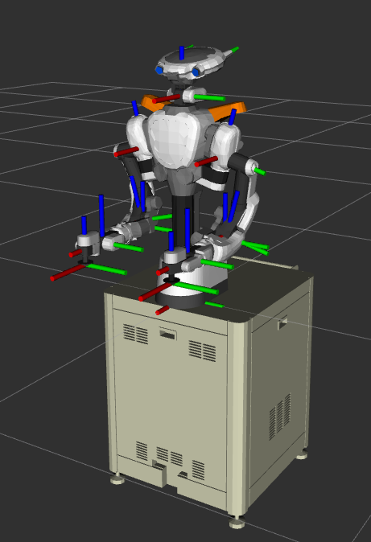
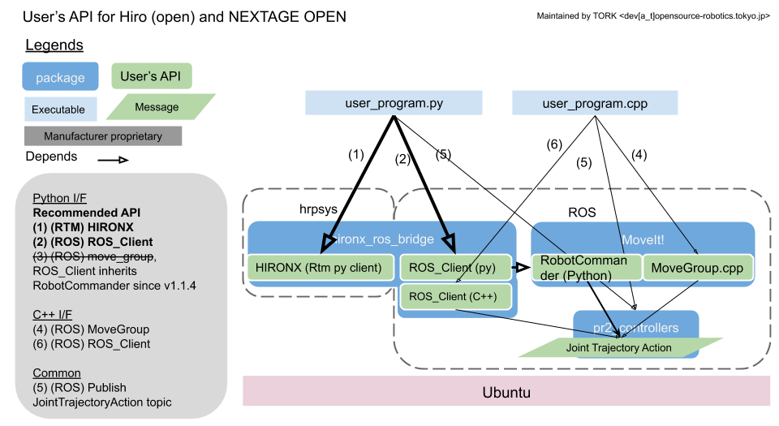

# Overview of robot hardware

## Robot specifications

For details, refer to the NEXTAGE specifications and instruction manuals on the Kawada Robotics site.

<!-- URLについてはNXFの英語版製品仕様が作成された後に修正 -->
- Kawada Robotics NEXTAGE Fillie - Products Specifications
  - Manufacturer's site
    - [https://nextage.kawadarobot.co.jp/fillie/open](https://nextage.kawadarobot.co.jp/fillie/open)
  - Degree of freedom: 15 axes
    - 6 axes arms x 2: shoulder Yaw-Pitch, elbow Pitch, wrist Roll-Pitch-Yaw
    - 2 axes neck: neck Yaw-Pitch
    - 1 axis waist: waist Yaw
  - Maximum load capacity
    - Single arm: 2.0 kg
    - Both arms: 4.0 kg
  - Camera
    - Head: stereo Camera 
    - Hand Camera (optional)

## Coordinate system

The NEXTAGE OPEN coordinate system is shown below.

The base coordinate is set to the center of the hip base.

- Base coordinate
  - x axis: positive-anterior/negative-posterior
  - Y-axis: positive-left/negative-right
  - Z axis: positive-up/negative-down


The coordinate system of each frame is as follows.

- Each coordinate axis and color notation
  - x axis: Red
  - Y-axis: Green
  - Z-axis: Blue



# Computer and Software Overview

The Kawada Robotics NEXTAGE OPEN robotics system has two computers:

### Computer for control

- Controller (QNX Computer)
  - Computer that controls the robot
  - QNX: Real-time Operating System
  - No software installation or modification is allowed.
  - Maintenance and update are possible.

### Development computer
- Development Computer Requirements Specification
  - Processor with 2.3GHz or faster and 2 or more cores  
  (Operation confirmed with Intel Core i5-5300U)
  - Memory of-8GB or more
  - Disk space of-20 GB or more
  - Ubuntu 18.04
    - Ubuntu 18.04 is reaching End of Standard Support in May 2023. Please implement security and other measures as necessary.
  - ROS Melodic
  - USB * 2 or more
    - For robot-mounted camera * 1 (USB 3.0 Type A)
    - Other applications * 1 or more (any standard)
  - At least 2 ports in total for Ethernet / WLAN
    - Connect the QNX Computer via Ethernet (robot owner only)

## Overview of the software

The following is a block diagram of the QNX and Ubuntu software components of the NEXTAGE OPEN.
Users can program robots with either ROS or RTM (hrpsys).


## Summary of API

There are two types of API used in NEXTAGE OPEN, namely RTM and ROS ,
You can also divide the ROS API into a ROS interface and a MoveIt interface.

- RTM API on hrpsys
- ROS API
  - ROS interfaces
  - MoveIt interfaces

Each API is available in programming languages such as Python and C++.

The following diagram shows the structure of the API.



# Maintenance and management

## Updating Ubuntu Software

To update all the software on the Ubuntu, execute the following command.

```
$ sudo apt-get update && sudo apt-get dist-upgrade
```

To update only NEXTAGE OPEN software, execute the following command.

```
$ sudo apt-get update && sudo apt-get install ros-melodic-rtmros-hironx
```
<!-- TODO github URL確定-->
Download the ros packages provided by Kawada Robotics (rtmros\_nextage_fillie_open.tar.bz2) from support site.
Decompress it into the catkin workspace and catakin_make.

```
$ tar jxvf rtmros_nextage_fillie_open.tar.bz2 -C ~/catkin_ws/src
$ cd ~/catkin_ws; catkin_make
```

<!-- ## QNX での作業 -->

<!-- ### QNX GUIツール - NextageOpenSupervisor -->

<!-- QNX に関する日常的な作業のうち次のものは -->
<!-- カワダロボティクスから提供されている GUI ツール NextageOpenSupervisor を用いて操作することができます。 -->

<!-- - コントロールボックス（QNXコンピュータ）のシャットダウン処理 -->
<!-- - アップデート -->

<!-- このツールは UIコンピュータ（Ubuntuコンピュータ/ビジョンPC）に -->
<!-- nxouser アカウントでログオンするとデスクトップ上にアイコンがあります。 -->

<!-- ### QNXのコマンド操作 -->

<!-- 本作業は QNX にログオンできることを前提としたものです。 -->
<!-- 次のコマンドで QNX にSSH接続とログオンを行います。 -->

<!-- ``` -->
<!-- YOURHOST$ ssh -l %QNX_YOUR_USER% %IPADDR_YOUR_QNX% -->
<!-- ``` -->

<!-- ##### QNX シャットダウンコマンド -->

<!-- ``` -->
<!-- QNX$ su -c '/opt/grx/bin/shutdown.sh' -->
<!-- ``` -->

<!-- ##### QNX リブートコマンド -->

<!-- ``` -->
<!-- QNX$ su -c '/bin/shutdown' -->
<!-- ``` -->

<!-- ### ログファイルの定期メンテナンス -->

<!-- ### QNXのログファイル -->

<!-- QNX のログファイルは `/opt/jsk/var/log` にあります。 -->

<!-- - Nameserver.log -->
<!-- - Modelloader.log -->
<!-- - rtcd.log -->

<!-- これらのログファイルは自動的に生成されますが，自動的には削除されません。 -->

<!-- ### ログファイルの圧縮・削除 -->

<!-- ディスクスペースにおいてログファイルはすぐに何ギガバイトにもなってしまします。 -->
<!-- これらのログファイルは自動的に削除される仕組みにはなっておりませんので， -->
<!-- 時おり `/opt/jsk/var/log` 下のログファイルを削除することをお勧めします。 -->

<!-- ログファイルの削除はスクリプトの実行もしくはリモートログインによる手動操作で行うことができます。 -->

<!-- ##### スクリプト操作によるログファイルの圧縮 -->

<!-- ``` -->
<!-- # Remove all raw .log files to free disk space. Same .zip file will be kept in the log folder. -->

<!-- $ rosrun hironx_ros_bridge qnx_fetch_log.sh nextage qnx_nxo_user archive -->
<!-- ``` -->

<!-- ##### 手動でのログファイルの削除 -->

<!-- QNX コンピュータログオンできる場合においては SSH 接続をして， -->
<!-- ディレクトリ `/opt/jsk/var/log` 下にあるログファイルを削除することができます。 -->

<!-- ##### ディスク空き容量の確認 -->

<!-- QNX コンピュータログオンできる場合においては SSH 接続をして， -->
<!-- ディスクの空き容量を確認することができます。 -->

<!-- ``` -->
<!-- QNX$ df -h -->
<!-- ``` -->

<!-- ディスク空き容量の例 -->
<!-- ``` -->
<!-- /dev/hd0t179 7.8G 7.1G 725M 92% / -->
<!-- /dev/hd0t178 229G 22G 207G 10% /opt/ -->
<!-- /dev/hd0 466G 466G 0 100% -->
<!-- ``` -->


<!-- ### QNXでのインストールやソフトウェア利用 -->

<!-- HIRO / NEXTAGE OPEN ソフトウェアはすべて公開されていますが， -->
<!-- それは HIRO / NEXTAGE OPEN でダウンロードしてただ実行するだけで済むということを意味していません。 -->
<!-- それらのソフトウェアは QNX オペレーティングシステム上で動いているコントローラボックスで -->
<!-- ビルド・コンパイルする必要があります。 -->
<!-- QNX 上ででコンパイルするには，地域のベンダーから購入できる開発者ライセンスが必要です。 -->

<!-- QNX に必要なソフトウェアをインストールする方法も開示されていません。 -->
<!-- QNX は開発者ライセンス以外にも，その運用者は運用認定が必要もしくは十分に運用に精通している必要がある商用ソフトウェアです。 -->
<!-- また，QNX では頑強なパッケージングインフラストラクチャ（ROSのようなもの）がないため， -->
<!-- インストール作業は非常に長い手作業となる可能性があり，エラーが発生しやすくなります。 -->

<!-- しかし，次のような場合には QNX 内での作業が必要となります。 -->

<!-- - 以前のクローズドソースの GRX コントローラに戻す必要があるとき -->
<!-- - デバッグ時に Ubuntu ソフトウェアの API で見られるログだけでは原因が不明な場合に QNX 上のログファイルを見るとき -->

<!-- このような場合には製造元またはソフトウェアサービスプロバイダからログオンアカウント情報を入手することができます。 -->


<!-- EOF -->
