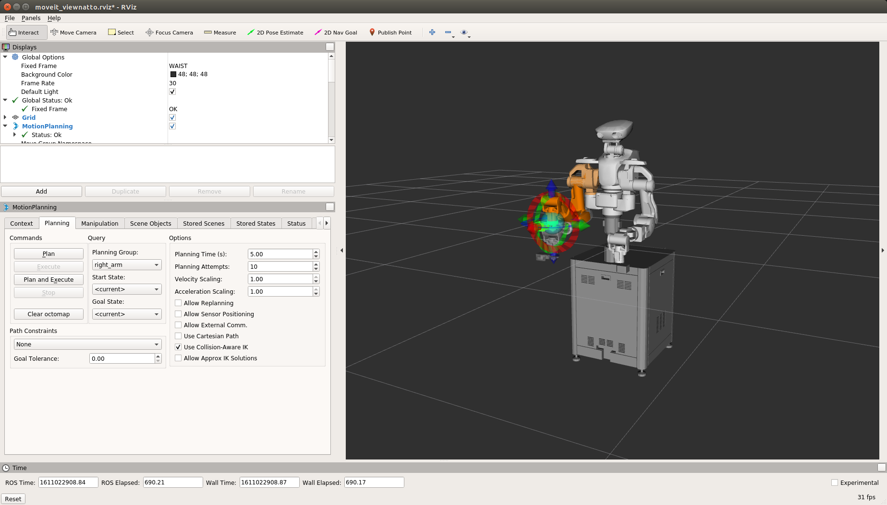
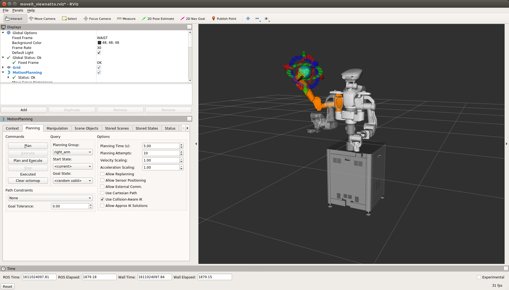
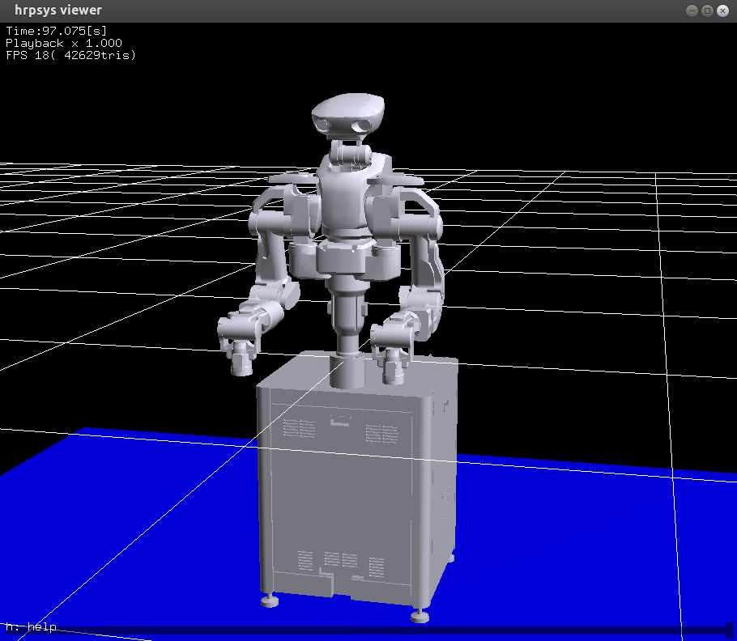

# Introduction

## Quick Start

### Starting the computer
- Refer to the instruction manual and press the power button on the controller.
- After turning on the controller, turn on the development PC. If the controller is turned on later, the development PC may not recognize the cameras.  
- Press the reset button on the switchbox.
If the robot LED light is green,
The robot is ready for operation.

### Starting ROS Servers

#### Running rtm_ros_bridge

Execute the following command on the development PC terminals to execute the ROS.

```
$ roslaunch nextage_fillie_open_ros_bridge nextage_fillie_open_ros_bridge_real.launch
```

NEXTAGE OPEN defaults can be accessed by hostname `nextage`,
It has been described in `nextage_fillie_open_ros_bridge_real.launch`.

If you change the host name, replace the `%HOSTNAME%` part of the command below with the desired host name and execute the command explicitly.

```
$ roslaunch nextage_fillie_open_ros_bridge nextage_fillie_open_ros_bridge_real.launch nameserver:=%HOSTNAME%
```

This program must be running when you operate the robot..

#### Checking ROS Processes

Open a terminal different from the terminal running rtm_ros_bridge.
You can identify the ROS node that is running by running the following command on the new terminal:

```
$ rosnode list
/diagnostic_aggregator
/hrpsys_profile
/hrpsys_ros_diagnostics
/hrpsys_state_publisher
/rosout
...
```
### Manipulation of robots by DiagnosisUI

Part of the robot's functions is a simple GUI,
You can perform the following functions from the DiagnosisUI:

- Joint calibration
- Releace momentary stop
- Confirmation of digital input/output, operation of digital output
- Servo ON/OFF
- Brake ON/OFF
- Acquisition of diagnostic reports and logs
- Starting uEyeDemo
- Shutdown controller

Please refer to [Use of DiagnosisUI](manual_en_tutorial_gui.html) for details.
The DiagnosisUI is started by the following commands from the terminals.

```
$ cd ~/
$ ./DiagnosisUI
```
First, enter the robot IP and press connect.
Each button located on the UI is enabled and can be operated.

### Running Operations in MoveIt!

Move the robots using the MoveIt! of the motion planning framework, which also includes the GUI of the ROS.

#### Starting the MoveIt!
Start MoveIt!.
Open the new terminal and execute the following command.

```
$  roslaunch nextage_fillie_open_moveit_config moveit_planning_execution.launch
```

<!--  -->

#### Planning and Implementing Operations in the MoveIt!
A marker represented by an arrow or a sphere is located at the tip of the robotic model displayed in the MoveIt!.
This is called an InteractiveMarker, which specifies the position and orientation of the hand tip.

Perform the following preparations before changing the hand position.

1. Turn Start State to < current > at the Planning tabs Query.
2. Turn Goal State to < current > at the Planning tabs Query.

Drag the InteractiveMarker slightly.
The wrist with different colors will be displayed.
The present robotic posture and the target posture specified in the InteractiveMarker are displayed.



Click plan in the Planning tabs.
The motion plans are displayed so that the arms are animated to the target position in the MoveIt!.

If the animated motion plan does not seem to have any problems, such as interference, including the situation around the real robot,
actually move the robot to the target posture.

- Note: **If servo is On ,robot moves.**

Click [Plan and Execute] in the Planning tabs.


The robots actually move as planned in the MoveIt!.

We will also move to other target postures.
In this case, the MoveIt! generates a random posture.

- Note: Proceed with the following steps while Checking the situation around the robot with respect to the generated target posture.

1. Select < random valid > in the Goal State of the Planning tabs Query:
2. Click < random valid > in the Goal State (Reclick to recreate)
3. Click [Plan] on the Commands → Check the operation Planning.
4. Safety check of robot operating environment, etc.
5. Click [Plan andExecute] on the Commands → Perform the action.



> Summary of Operation Planning and Execution Procedures in >MoveIt!
>
> 1. Turn the Start State to < current > at the Planning tabs Query.
> 2. Turn the Goal State to < current > at the Planning tabs Query.
> 3. Drag the robot's hands with the InteractiveMarker on the MoveIt! and move to the target posture.
> 4. Click [Plan] on the Planning tab Commands to check the operation plan.
> 5. Check that there are no problems such as interference with the surrounding environment due to robot operation.
> 6. Click [Plan and Execute] on the Planning tab Commands.

### Robot shutdown process

<!-- #### ロボットをサーボオフ姿勢にする -->

<!-- ロボットの各関節をサーボオフ姿勢にしてサーボ切ります。 -->

<!-- - 注意: **ロボットが動きます．** -->

<!-- Hironx Dahsboard の [ Goto init pose ] ボタンを押してください． -->

<!-- これによりロボットの各関節がサーボオフ姿勢になり、サーボが切れます． -->

#### Completion of all programs

Exit all programs except the one running DiagnosisUI.
Terminate all terminals except the one running DiagnosisUI by `Ctrl-c`.
At this time, you exit hrpsys-simulator from the terminal with Ctrl-c, you may get the error "Sorry, the application XXX has stopped unexpectedly.". If the stopped applications are related to hrpsys_ros_bridge, this is not a problem because they are applications that are scheduled to be terminated.

#### Stopping the QNX

Press the [Shutdown QNX] button on the DiagnosisUI to shut down the computer.

#### Termination of Ubuntu

Terminates the Ubuntu with commands such as `$sudo shutdown now`.

## Precautions
If there is a difference between the current joint angle and the last command angle, an unintended sudden movement may occur at the joint with the difference when executing a movement command in the following manner.

- iPython
  - robot.goInitial
  - robot.goOffPose
  - robot.setJointAnglesOfGroup
  - robot.playPatternOfGroup
- MoveIt

Differences between the current joint angle and the last command angle can be caused by the following factors

- Pause during the movement
- Direct posture change by hand
- Posture change due to the weight of the hand or other parts when the servo is off

Unintended sudden movement can be avoided by executing a movement to the current angle in advance for joints where there is a difference between the current joint angle and the last command angle. 
In iPython, for `setJointAnglesOfGroup` or `playPatternOfGroup`, specify the current joint angle for the movement target and 0.001 for the movement time. You can also avoid this by pre-executing movement commands other than the above (such as `setTargerPose`). In the case of MoveIt, you can avoid this by executing the movement to the current angle (by clicking the [ Plan and Execute ] button) for the part where there is a difference between the current joint angle and the last command angle.

## Kinetics simulation

### Dynamic Simulations of RTM-hrpsys-simulator

The core functions of robots run on the OpenRTM framework.
The functions of robots can be virtually realized by a simulator called a hrpsys-simulator based on this OpenRTM.
This manikin can be used without using the higher layers provided by the ROS.

This simulator is sufficient in many cases to run programs that are not specially-purposed .

#### Execution of the simulator

Start the simulator to "mimic" the actual robot.
Note that `rtmlaunch` is used instead of `roslaunch` and execute the following commands:

```
$ rtmlaunch nextage_fillie_open_ros_bridge nextage_fillie_open_ros_bridge_simulation.launch
```

> The launch files perform two main tasks:
>
> First, load the virtual robot into the manikin.
>
> ```
> $ rtmlaunch nextage_fillie_open_ros_bridge nextage_fillie_open_startup.launch
> ```
>
> The simulated robots run only on OpenRTM based software.
>
> Second, create a "bridge" that connects the two spaces of the ROS and the OpenRTM in order to operate the robots via the ROS.
>
> ```
> $ roslaunch nextage_fillie_open_ros_bridge  hironx_ros_bridge.launch
> ```

When the following command prompt appears, the simulation is working properly.

```
[ INFO] [1375160303.399785831, 483.554999999]: [HrpsysSeqStateROSBridge0] @onExecutece 0 is working at 201[Hz]
[ INFO] [1375160304.408500642, 484.544999999]: [HrpsysSeqStateROSBridge0] @onExecutece 0 is working at 198[Hz]
```

The hrpsys simulator viewer is displayed as follows.

<!--  -->



When exiting hrpsys-simulator from the terminal with Ctrl-c, the error "Sorry, the application XXX has stopped unexpectedly.". may occur. If the stopped application is related to hrpsys_ros_bridge or hrpsys-base, there is no problem because they are applications that are scheduled to be terminated.

#### Starting the MoveIt! and Handling Simulation Robots

Similar to the actual robot, you can start the MoveIt! to operate the simulated robot.

```
$  roslaunch nextage_fillie_open_moveit_config moveit_planning_execution.launch
```

Operations within the MoveIt! are the same for the real robot and the simulated robot.
Run the InteractiveMarker, plan and execute the operation.


<!-- ### ROS の動力学シミュレーション - Gazebo -->

<!-- NEXTAGE OPEN の Gazebo シミュレーションを起動します。 -->

<!-- - メモ: ROS / Gazebo でのシミュレーションのため rtm_ros_bridge は不要 -->

<!-- ``` -->
<!-- $ roslaunch nextagea_gazebo nextagea_world.launch -->
<!-- ``` -->

<!-- Gazebo nextage_world に -->
<!-- セスナ機、カフェのテーブル、建設用のバレル、HUSKYロボットオブジェクトをインサートした図 -->

<!--  -->
<!-- <\!-- EOF -\-> -->
