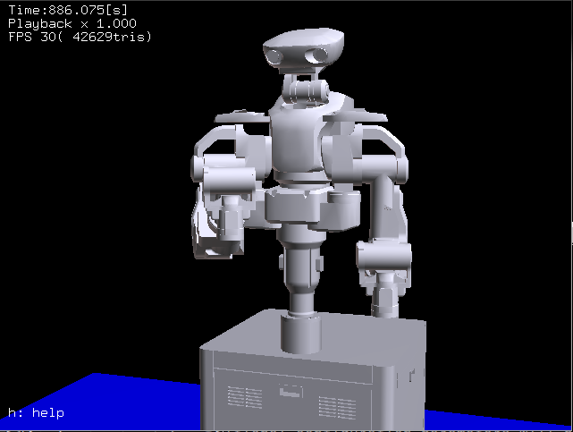

# Tutorial: MoveIt! Python interfaces

## MoveIt! Commander

Movelt does not provide only functions such as motion planning from the GUI (RViz),
but also functions like Commander,
a programming interface where you can move the robot using different programming languages.

## MoveIt! Python Interfaces Usage Environments

The environment of Python interface for MoveIt!, using MoveIt! Python Commander, is as follow.

- Rtm_ros_hironx: versions 1.1.4 and later (Hironx/NEXTAGE Fillie OPEN)
- Recommended Programming Interface: `ROS_Client` (derived from RobotCommander)
- RobotCommander is the MoveIt!'s Python programming interface

If you do not have MoveIt!'s Python interface moveit_commander package on your Ubuntu computer,
you need to install it.

```
$ sudo apt-get install ros-%YOUR_ROS_DISTRO%-moveit-commander
```

## Robotics from MoveIt! Python interfaces

### Starting the MoveIt! Python interfaces

#### Running rtm_ros_bridge

Run rtm_ros_bridge.

```
$ roslaunch nextage_fillie_open_ros_bridge nextage_fillie_open_ros_bridge_real.launch nameserver:=%HOSTNAME%
```

#### Starting the MoveIt! Servers

To run a program based on the class `ROS_Client`,
MoveIt! nodes must be running as servers for the Clients.

Start MoveIt!.

```
$ roslaunch nextage_fillie_open_moveit_config moveit_planning_execution.launch
```

### Robotics with MoveIt! Commander in Python
A sample program that uses MoveIt! Commander from Python ,
let's look at how to operate NEXTAGE Fillie OPEN.


<!-- - [https://github.com/tork-a/rtmros_nextage/blob/indigo-devel/nextage_ros_bridge/script/nextage_moveit_sample.py](https://github.com/tork-a/rtmros_nextage/blob/indigo-devel/nextage_ros_bridge/script/nextage_moveit_sample.py) -->

- ~/catkin_ws/src/nextage_fillie_open_ros_bridge/script/nextage_fillie_open_moveit_sample.py

The entire sample code is listed below.
Then we look at what we are doing for each line.

```python
1 #!/usr/bin/env python
2 ########################################################################################
3 # @file     nextage_fillie_open_moveit_sample.py (derive from nextage_moveit_sample.py)#
4 # @brief    Nextage Move it demo program                                               #
5 # @author   Ryu Yamamoto                                                               #
6 # @date     2015/05/26                                                                 #
7 ########################################################################################
8 import moveit_commander
9 import rospy
10 import geometry_msgs.msg
11
12 def main():
13         rospy.init_node("moveit_command_sender")
14
15         robot = moveit_commander.RobotCommander()
16
17         print "=" * 10, " Robot Groups:"
18         print robot.get_group_names()
19
20         print "=" * 10, " Printing robot state"
21         print robot.get_current_state()
22         print "=" * 10
23
24         rarm = moveit_commander.MoveGroupCommander("right_arm")
25         larm = moveit_commander.MoveGroupCommander("left_arm")
26
27         print "=" * 15, " Right arm ", "=" * 15
28         print "=" * 10, " Reference frame: %s" % rarm.get_planning_frame()
29         print "=" * 10, " Reference frame: %s" % rarm.get_end_effector_link()
30
31         print "=" * 15, " Left ight arm ", "=" * 15
32         print "=" * 10, " Reference frame: %s" % larm.get_planning_frame()
33         print "=" * 10, " Reference frame: %s" % larm.get_end_effector_link()
34
35         #Right Arm Initial Pose
36         rarm_initial_pose = rarm.get_current_pose().pose
37         print "=" * 10, " Printing Right Hand initial pose: "
38         print rarm_initial_pose
39
40         #Light Arm Initial Pose
41         larm_initial_pose = larm.get_current_pose().pose
42         print "=" * 10, " Printing Left Hand initial pose: "
43         print larm_initial_pose
44
45         target_pose_r = geometry_msgs.msg.Pose()
46         target_pose_r.position.x = 0.3
47         target_pose_r.position.y = -0.3
48         target_pose_r.position.z = 0.1
49         target_pose_r.orientation.x = 0
50         target_pose_r.orientation.y = 0
51         target_pose_r.orientation.z = 0
52         target_pose_r.orientation.w = 1
53         rarm.set_pose_target(target_pose_r)
54
55         print "=" * 10," plan1 ..."
56         rarm.go()
57         rospy.sleep(1)
58
59         target_pose_l = [
60                 target_pose_r.position.x,
61                 -target_pose_r.position.y,
62                 target_pose_r.position.z,
63                 target_pose_r.orientation.x,
64                 target_pose_r.orientation.y,
65                 target_pose_r.orientation.z,
66                 target_pose_r.orientation.w
67         ]
68         larm.set_pose_target(target_pose_l)
69
70         print "=" * 10," plan2 ..."
71         larm.go()
72         rospy.sleep(1)
73
74         #Clear pose
75         rarm.clear_pose_targets()
76
77         #Right Hand
78         target_pose_r.position.x = 0.2
79         target_pose_r.position.y = 0
80         target_pose_r.position.z = 0.3
81         target_pose_r.orientation.x = 0
82         target_pose_r.orientation.y = 0
83         target_pose_r.orientation.z = 0
84         target_pose_r.orientation.w = 1
85         rarm.set_pose_target(target_pose_r)
86
87         print "=" * 10, " plan3..."
88         rarm.go()
89         rospy.sleep(1)
90
91         print "=" * 10,"Initial pose ..."
92         rarm.set_pose_target(rarm_initial_pose)
93         larm.set_pose_target(larm_initial_pose)
94         rarm.go()
95         larm.go()
96         rospy.sleep(2)
97
98 if __name__ == '__main__':
99     try:
100         main()
101     except rospy.ROSInterruptException:
102         pass
```

For the main parts of the Python scripts that plan and run, the procedure is as follows.

1. Specify the position and orientation of the end effector link as a target.
2. Move to the target position

In preparation for this, the posture of the end effector is acquired.

Look concretely at each line of the Python scripts.

For MoveIt!'s Python interfaces
Provided at `moveit_command. MoveGroupCommander`.

```python
import moveit_commander
import rospy
import geometry_msgs.msg
```

To use `MoveGroupCommander` from this Python script
call `rospy.init_node()` to execute the ROS node.

```python
rospy.init_node("moveit_command_sender")
```

Instantiate the RobotCommander.

```python
robot = moveit_commander.RobotCommander()
```

Gets and displays a list of all group names for robots.

```python
print "=" * 10, " Robot Groups:"
print robot.get_group_names()
```

Displaying the status of the entire robot is useful for debugging.

```python
print "=" * 10, " Printing robot state"
print robot.get_current_state()
```

Gets the posture of each arm of the current robot.

```python
rarm_current_pose = rarm.get_current_pose().pose
larm_current_pose = larm.get_current_pose().pose
```

The posture of each arm of the current robot is assigned to the initial posture object.

```python
rarm_initial_pose = rarm.get_current_pose().pose
print "=" * 10, " Printing Right Hand initial pose: "
print rarm_initial_pose

larm_initial_pose = larm.get_current_pose().pose
print "=" * 10, " Printing Left Hand initial pose: "
print larm_initial_pose
```

Run the robot according to the motion plan.

**Execution Plan 1**

```python
target_pose_r = geometry_msgs.msg.Pose()
target_pose_r.position.x = 0.4
target_pose_r.position.y = -0.33
target_pose_r.position.z = 0.121
target_pose_r.orientation.x = 0
target_pose_r.orientation.y = 0
target_pose_r.orientation.z = 0
target_pose_r.orientation.w = 1
rarm.set_pose_target(target_pose_r)

print "=" * 10," plan1 ..."
rarm.go()
rospy.sleep(1)
```


**Execution Plan 2**

```python
target_pose_l = [
    target_pose_r.position.x,
    -target_pose_r.position.y,
    target_pose_r.position.z,
    target_pose_r.orientation.x,
    target_pose_r.orientation.y,
    target_pose_r.orientation.z,
    target_pose_r.orientation.w
]
larm.set_pose_target(target_pose_l)

print "=" * 10," plan2 ..."
larm.go()
rospy.sleep(1)
```


**Execution Plan 3**

```python
rarm.clear_pose_targets()

#Right Hand
target_pose_r.position.x = 0.4854
target_pose_r.position.y = -0.012751
target_pose_r.position.z = 0.29067
target_pose_r.orientation.x = 0.000045184
target_pose_r.orientation.y = 0.00005316
target_pose_r.orientation.z = 0.000022341
target_pose_r.orientation.w = 1
rarm.set_pose_target(target_pose_r)

print "=" * 10, " plan3..."
rarm.go()
rospy.sleep(1)
```




**Go Initial**

```python
print "=" * 10,"Initial pose ..."
rarm.set_pose_target(rarm_initial_pose)
larm.set_pose_target(larm_initial_pose)
rarm.go()
larm.go()
rospy.sleep(2)
```


<!-- 動画: "Nextage Move it! demo" [https://www.youtube.com/watch?v=heKEKg3I7cQ](https://www.youtube.com/watch?v=heKEKg3I7cQ) -->

These motion plans are also displayed on the RViz displaying the MoveIt!.

By actually executing the sample program,
Check whether the NEXTAGE OPEN robots are moving as planned.

- Note: **Robot moves.**

Run the sample program from the terminal by executing the following command:

```
$ rosrun nextage_fillie_open_ros_bridge nextage_fillie_open_moveit_sample.py
```

There are many more methods in MoveIt! Commander,
see the ROS Wiki moviet_commander.

- ROS Wiki - moveit_commander
  - [http://wiki.ros.org/moveit_commander](http://wiki.ros.org/moveit_commander)


<!-- EOF -->
