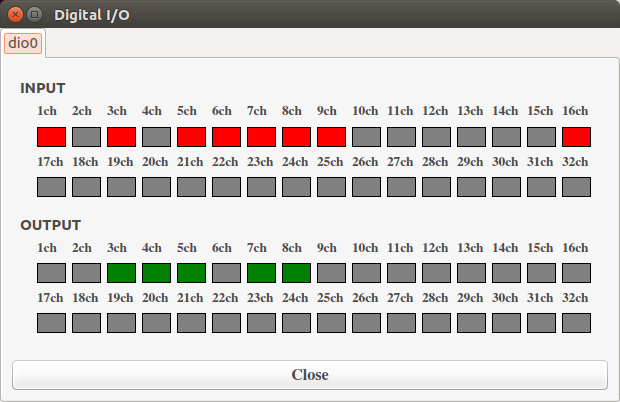
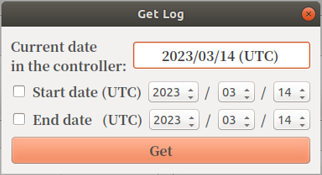

# DiagnosisUIの使い方

ロボットの一部の機能を簡易GUIである、DiagnosisUIから以下の機能を実行できます。

- ジョイントキャリブレーション
- Digital I/O の確認、制御
- Servo ON/OFF
- Brake ON/OFF
- 一時停止の解除
- 診断レポートとログの取得
- コントローラのシャットダウン
- uEyeDemoの起動

## DiagnosisUIの起動とロボットとの接続 <!--Starting the DiagnosisUI and Connecting Robots-->

DiagnosisUIを起動します。新しくターミナルを開いて次のコマンドを実行してください。

```
$ source /opt/ros/melodic/setup.bash
$ cd ~/;./DiagnosisUI
```

※ `$ source /opt/ros/melodic/setup.bash`は事前に.bashrcに設定していれば省略できます。


DiagnosisUIの起動直後は、ConnectボタンとuEyeDemoボタンしか使用できません。
まずはHostname or IPaddr の入力ボックスにロボットのホスト名またはIPアドレスを入力し、[connect] ボタンを押してください(デフォルトではnextageと設定されています)。
ロボットとの接続に成功すると、全てのボタンが使用可能になります。
接続に失敗した場合は、ユーザPCのネットワーク設定や、LANケーブルの接続を確認してください。

<!--## ジョイントキャリブレーション-->
<!--ロボットが起動後に、LEDが青点滅の状態になったら関節角度のエンコーダのキャリブレーションを行ってください。-->
<!--[Joint Calibration]ボタンをクリックすることでのエンコーダのキャリブレーションを行います。-->
<!-- ロボット起動後、ロボットの関節原点復帰に失敗(LEDが青点滅)の場合にこの作業を行います。 -->
<!-- Joint Calibrationボタンを押すことでジョイントキャリブを行います。 -->
<!--ジョイントキャリブに成功するとLEDが緑点灯になります。-->

## 一時停止解除<!--End Pause-->

スイッチボックスの一旦停止スイッチを「一旦停止」位置に回す、
または手動運転モードにおいてイネーブルスイッチを離す、あるいは握り込むとロボットが一時停止になります。
このとき、以下の手順で復帰してください。
- 自動運転モードの場合:
  - 一旦停止スイッチを「作動」位置に戻す
  - [Suspend Resume] ボタンを押す
- 手動運転モードの場合:
  - 一旦停止スイッチを「作動」位置に戻す
  - イネーブルスイッチを中間位置で保持する
  - [Suspend Resume] ボタンを押す

ただし、上位にある動作生成コントローラの指令値出力が止まってから復帰できます。  
e.g. 10秒間で移動する動作の動作中にロボットを一時停止状態にしたら、
ロボットの動作が止まりますが、上位にあるコントローラが計画通りに10秒間指令値を出力し続けます。
この10秒の間に[Suspend Resume]ボタンを押しても復帰しません。  
また、低速で動作中に停止するなど、停止直前の動作によっては[Suspend Resume]ボタンの操作なしで復帰する場合があります。

<!-- ロボットの一旦停止からの復帰条件は"ジョイントの現在値と同じ指令値を連続2回を受信"となります。 -->
<!-- このボタン押すと、指令値を現在値と一瞬に上書きするが、上位にある動作生成コントローラの動作はキャンセルされないので、 -->
<!-- 指令値はまたすぐに上位にある動作生成コントローラの出力に -->
<!-- すなわち、 -->

## Digital Input/Outputの確認、Digital Outputの操作<!--Checking the Digital Input/Output and operating the Digital Output-->

[Digital I/O]ボタンを押すとDIOの操作ウィンドウが起動します。



この画面におけるDIOの状態は100msの周期で更新されます。

- Inputの表示
  - 赤：ショート
  - 灰：オープン
- Outputの表示
  - 緑：ショート
  - 灰：オープン

## サーボオン/オフ<!--Servo ON/OFF-->

[Servo ON]ボタンでサーボを入れ、
[Servo OFF]ボタンでサーボを切ります。
一旦停止中にはサーボオン操作はできません。

## ブレーキオン/オフ<!--Brake ON/OFF-->

[Brake ON]ボタンで左右両腕のブレーキをオンにします。
[Brake OFF Right/Left]ボタンで左右どちらかの腕のブレーキを解除できます。

## 診断レポートとログの取得<!--Get Emergency Stop Log-->

トラブル発生時、お問合せの際に診断レポートとログが必要となることがあります。
[Get Log]ボタンを押すと取得するログの期間を指定する画面が開かれます。
ここでログの取得開始/終了日の日付とチェックボックスを入力し、Getボタンを押すと、日単位のログデータが"log_開始日-終了日.tar.bz2"としてカレントディレクトリにコピーされます。取得開始/終了日は、画面に表示されている今日の日付を参考にコントローラの時間で指定してください。コントローラのタイムゾーンはUTCに設定されています。
診断レポートとログは暗号化されるため、ユーザが閲覧することができません。



- 開始日のチェックボックス  
  
  チェックにより、取得開始日の指定が有効化されます。  
  なしの場合は、一番古いログの日付が開始日として適用されます。

- 終了日のチェックボックス  
  
  チェックすると、取得終了日の指定が有効化されます。  
  なしの場合は、最新のログの日付が終了日として適用されます。


## uEyeDemoの起動<!--hoge-->

 [uEyeDemo] ボタン押すとuEyeカメラの操作画面が起動します。
この画面からカメラの状態を確認できます。

## コントローラのシャットダウン<!--Shutdown of the controller-->

[Shutdown QNX] ボタン押すとコントローラの電源をオフにします。
ユーザPCの電源は別途でシャットダウンしてください。
