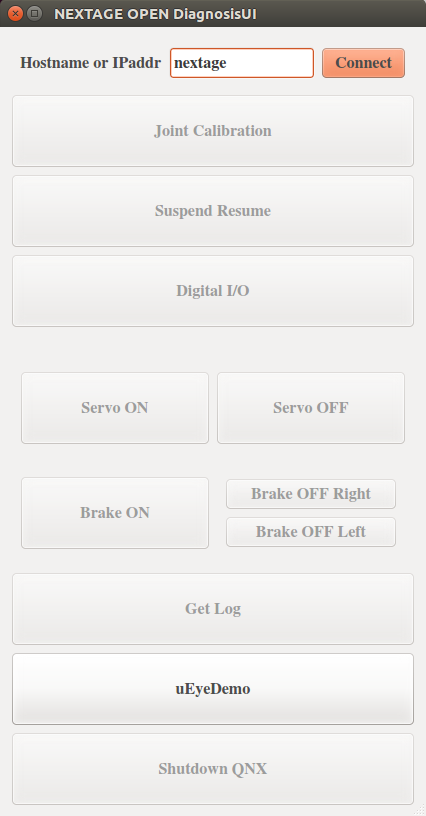
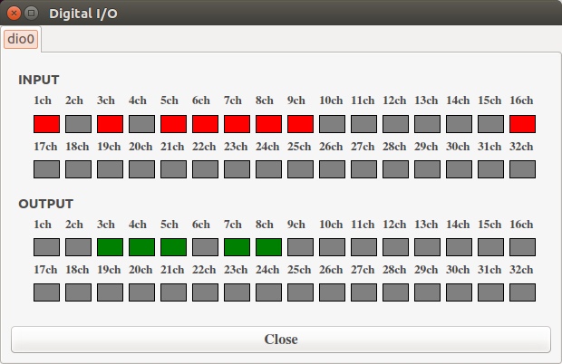

# Use of DiagnosisUI

The following functions can be executed from the DiagnosisUI, which is a simplified graphical user interface for some functions of robots.

- Joint calibration
- Releace momentary stop
- Confirmation of digital input/output, operation of digital output
- Servo ON/OFF
- Brake ON/OFF
- Acquisition of diagnostic reports and logs
- Starting uEyeDemo
- Shutdown controller

## Starting the DiagnosisUI and Connecting Robots
Start DiagnosisUI.
Open a new terminal and execute the following command.

```
$ source /opt/ros/melodic/setup.bash
$ cd ~/;./DiagnosisUI
```

※ `$ source /opt/ros/melodic/setup.bash` can be omitted if set up in .bashrc in advance.



Only the Connect and uEyeDemo buttons can be used immediately after starting the DiagnosisUI.
First, enter the robot hostname or IP-address in the Hostname or IPaddr's entry box, and then press connect (defaulted to nextage).
When the connection with the robot is successful, all buttons are enabled.
If the connection fails, check the network settings of the user PC and the connection of the LAN cable.
<!--
## ジョイントキャリブレーション-->
<!--ロボットが起動後に、LEDが青点滅の状態になったら関節角度のエンコーダのキャリブレーションを行ってください。-->
<!--[Joint Calibration]ボタンをクリックすることでのエンコーダのキャリブレーションを行います。-->
<!-- ロボット起動後、ロボットの関節原点復帰に失敗(LEDが青点滅)の場合にこの作業を行います。 -->
<!-- Joint Calibrationボタンを押すことでジョイントキャリブを行います。 -->
<!--ジョイントキャリブに成功するとLEDが緑点灯になります。-->

## Releace momentary stop
Turn the momentary stop witch of the switch box to the "Momentary Stop" position,
Or in the manual operation mode, release or grasp the enable switch to pause the robot.  
At this time, recover from the error by the following procedure.
- For Automatic Operation Mode:
  - Return the stop switch to the "Active" position once
  - Press [Suspend Resume].
- For Manual Operation Mode:
  - Return the stop switch to the "Active" position once
  - Hold the enable switch in the intermediate position
  - Press [Suspend Resume].

However, the output of the command value of the higher-order operation generation controller can be stopped before returning.  
e.g. If the robot is paused while moving for 10 seconds,
the robot stops operating, but the upper controller continues to output the command value as planned for 10 seconds.Even if the [Suspend Resume] button is pressed for the 10 seconds, the robot does not return.  
In addition, depending on the operation immediately before stopping, such as stopping during low-speed operation, the system may return to normal operation without operating the [Suspend Resume] button.

<!-- ロボットの一旦停止からの復帰条件は"ジョイントの現在値と同じ指令値を連続2回を受信"となります。 -->
<!-- このボタン押すと、指令値を現在値と一瞬に上書きするが、上位にある動作生成コントローラの動作はキャンセルされないので、 -->
<!-- 指令値はまたすぐに上位にある動作生成コントローラの出力に -->
<!-- すなわち、 -->

## Checking the Digital Input/Output and operating the Digital Output

Press the [Digital I/O] button to start the DIO window.



The DIO status on this screen is updated at 100 ms intervals.

- Displaying the Input
  - Red: Short
  - Grey: open
- Displaying the Output
  - Green: Short
  - Grey: open

## Servo ON/OFF

Turn on the servos with the [Servo ON] button,
Turn off the servos with the [Servo OFF] button.
If robot is the momentary stop state, you can not turn on the servos.

## Brake ON/OFF

Use the [Brake ON] button to turn on the brakes on the right and left arms.
You can release the brakes on either of the left or right arms with the [Brake OFF Right/Left] button.

## Get diagnosis reports and logs

An diagnosis reports and logs may be required when a trouble occurs or an inquiry is made.
Press the [Get Log] button to open a screen for specifying the log period to be retrieved.
Check the checkbox of the year and month, and press get to copy the daily log data to the current directory as "log_startday-finishday.tar.bz2". The start/end date should be specified in controller time, referring to today's date shown on the screen. The controller's time zone is set to UTC.
The diagnosis reports and logs is encrypted and cannot be viewed by the user.


- Start date check box  
  
  Checking this checkbox enables you to specify the start date of acquisition.  
  If unchecked, the oldest log date will be applied as the start date.

- End date check box  
  
  Checking this checkbox enables to specify the end date of acquisition.  
  If not checked, the date of the latest log will be applied as the end date.

## Starting the uEyeDemo

Press the [uEyeDemo] button to start the operation screen of the uEye camera.
You can check the camera status from this screen.

## Shutdown of the controller

Press Shutdown QNX to turn off the controller.
Shut down the power of the user PC separately.
