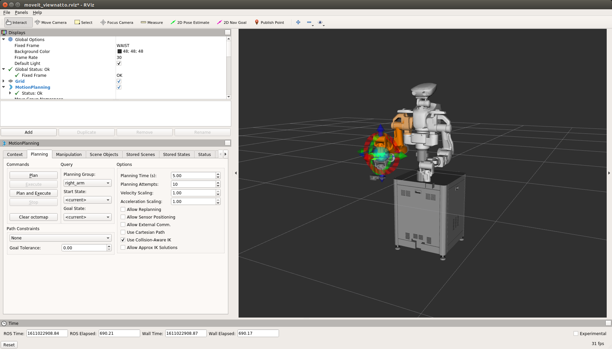
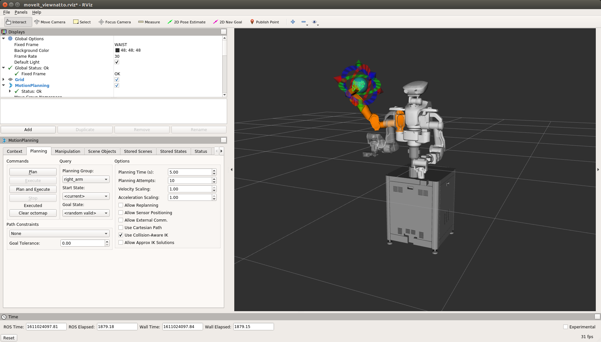

# はじめに

## クイックスタート<!--quick-start-->

### コンピュータの起動<!--starting-the-computer-->
- 取扱説明書を参照し、コントローラの電源ボタンを押してください。
- コントローラの電源投入後、開発用PCの電源を入れてください。コントローラの電源投入を後に行うと開発用PCでカメラを認識しない恐れがあります。  
  
- ロボットのLEDライトが青色点灯になったらスイッチボックスのresetボタンを押してください。
ロボットの動作準備が整った場合、
LEDが緑色点灯となります。

### ROS サーバの起動<!--starting-ros-servers-->

#### rtm_ros_bridge の実行

開発用PCのターミナルで下記のコマンドを実行してROS ソフトウェアを実行してください。

```
$ roslaunch nextage_fillie_open_ros_bridge nextage_fillie_open_ros_bridge_real.launch
```

出荷時ではホスト名 `nextage` でアクセスすることができ，
それは `nextage_fillie_open_ros_bridge_real.launch` 内に既に記述されています。

ホスト名を変更した場合には下記コマンドの`%HOSTNAME%` の部分を変更したホスト名に置き換え，明示的にコマンドを実行してください。

```
$ roslaunch nextage_fillie_open_ros_bridge nextage_fillie_open_ros_bridge_real.launch nameserver:=%HOSTNAME%
```

このプログラムはロボットを操作するときには実行されている必要があります。

#### ROS プロセスの確認

rtm_ros_bridge を実行しているターミナルとは別のターミナルを開いてください。
新しいターミナルで次のコマンドを実行することで動作しているROSノードを確認することができます。

```
$ rosnode list
/diagnostic_aggregator
/hrpsys_profile
/hrpsys_ros_diagnostics
/hrpsys_state_publisher
/rosout
...
```
### DiagnosisUI によるロボットの操作<!--manipulation-of-robots-by-diagnosisui-->

ロボットの一部の機能を簡易GUIである、
DiagnosisUIから以下の機能を実行できます。
- ジョイントキャリブレーション
- Digital I/O の確認、制御
- Servo ON/OFF
- Brake ON/OFF
- 一時停止の解除
- 診断レポートとログの取得
- コントローラのシャットダウン
- uEyeDemoの起動

使用方法については[DiagnosisUIの使い方](manual_ja_tutorial_gui.html) を参照してください。
DiagnosisUIはターミナルから 以下のコマンドで起動します.
```
$ cd ~/
$ ./DiagnosisUI
```
はじめに、ロボットのIPを入力し、connectボタンを押してください。
UIに配置される各ボタンが使用可能状態になり、各操作を行えます。

### MoveIt! での動作の実行<!--running-operations-inmoveit-->

ROS の GUI も備えたモーションプランニングフレームワークの MoveIt! を用いてロボットを動かしてみます。

#### MoveIt! の起動

MoveIt! を起動します。新しくターミナルを開いて次のコマンドを実行してください。

```
$ roslaunch nextage_fillie_open_moveit_config moveit_planning_execution.launch
```

<!--  -->

#### MoveIt! での動作計画と実行

MoveIt! 内に表示されているロボットモデルの手先に矢印や球で表現されているマーカがあります。
これは InteractiveMarker と呼ばれるもので、手先の位置と姿勢を指定します。
MoveIt!の使い方はについては公式サイトを参照してください。[MoviIt公式サイト](https://moveit.ros.org/)

手先姿勢を変更する前に次の準備を実行してください。

1. Planning タブ Query の Select Start State を < current > とする。
2. Planning タブ Query の Select Goal State を < current > とする。

InteractiveMarker をマウスでドラッグして少し移動させます。
色違いの腕が表示されるようになります。
現在のロボットの姿勢と InteractiveMarker で指定した目標姿勢が表示されます。



Planning タブ内の [ Plan ] ボタンをクリックしてください。
MoveIt! 内においてアニメーションで腕が目標姿勢になるように動作計画が表示されます。

アニメーション表示された動作計画で実機ロボットの周辺環境を含めて干渉など問題がなければ、
実際にロボットを目標姿勢になるように動かしてみます。

- 注意: **サーボオン状態の場合はロボットが実際に動きます。**

Planning タブ内の [ Plan and Execute ] ボタンをクリックしてください。


MoveIt! で動作計画したように実際にロボットが動きます。

他の目標姿勢にも動かします。
ここでは MoveIt! にランダムな姿勢を生成させます。

- 注意: 生成された目標姿勢に対するロボットの周辺環境を確認しながら下記の手順を進めてください。


1. Planning タブ Query の Goal State で < random valid > を選択
2. Goal State の < random valid > ボタンをクリック（再クリックで再生成）
3. Commands の [ Plan ] ボタンをクリック → 動作計画の確認
4. ロボット動作環境などの安全確認
5. Commands の [ Plan and Execute ] ボタンをクリック → 動作の実行



> MoveIt! での動作計画と実行の手順まとめ
>
> 1. Planning タブ Query の Start State を < current > にする
> 2. Planning タブ Query の Goal State を < current > にする
> 3. MoveIt! 上の InteractiveMarker でロボットの手をドラックして目標姿勢に移動
> 4. Planning タブ Commands の [ Plan ] ボタンをクリックして動作計画を確認
> 5. ロボットの動作による周辺環境との干渉などの問題がないことを確認
> 6. Planning タブ Commands の [ Plan and Execute ] ボタンをクリック


### ロボットのシャットダウン処理<!--robot-shutdown-process-->

<!-- #### ロボットをサーボオフ姿勢にする -->

<!-- ロボットの各関節をサーボオフ姿勢にしてサーボ切ります。 -->

<!-- - 注意: **ロボットが動きます．** -->

<!-- Hironx Dahsboard の [ Goto init pose ] ボタンを押してください． -->

<!-- これによりロボットの各関節がサーボオフ姿勢になり、サーボが切れます． -->

#### 全プログラムの終了<!--Shutdown-all-program-->

実行しているDiagnosisUI以外のプログラムを全て終了します。
DiagnosisUIを実行中のものを除いた全てのターミナルで `Ctrl-c` により終了してください。  
このとき、エラー「残念ながら、アプリケーション○○○が予期せず停止しました。」が発生する場合があります。停止したアプリケーションがhrpsys_ros_bridgeの関連のものである場合、それらは終了予定のアプリケーションであるため問題ありません。

#### QNX の停止<!--Stop-QNX-->

DiagnosisUIの[Shutdown QNX] ボタンを押してコンピュータのシャットダウンを行ってください。

#### Ubuntu の終了<!--Shutdown-Ubuntu-->

コマンド `$ sudo shutdown now` などで Ubuntu を終了します。

## 注意事項<!--Operational Precautions-->
現在の関節角度と最後の指示角度に差異がある場合、以下の方法で動作指令を実行すると差異がある関節で意図しない急激な動作が発生する場合があります。

- iPython
  - robot.goInitial
  - robot.goOffPose
  - robot.setJointAnglesOfGroup
  - robot.playPatternOfGroup
- MoveIt

現在の関節角度と最後の指示角度に差異は以下の要因で発生します。

- 動作中の一旦停止
- 直接手によって姿勢を変更
- サーボオフ時のハンドなどの自重による姿勢の変化

現在の関節角度と最後の指示角度に差異がある関節に対してあらかじめ現在角度への動作を実行することで、意図しない急激な動作を回避できます。iPythonの場合は、`setJointAnglesOfGroup`または`playPatternOfGroup`に対して移動目標に現在の関節角度、動作時間に0.001を指定して実行します。上記以外の動作コマンド（`setTargerPose`など）を事前に実行しても回避できます。MoveItの場合は、現在の関節角度と最後の指示角度に差異がある部位を指定して現在の角度へ動作を実行（[ Plan and Execute ]ボタンをクリック）すると回避できます。

## 動力学シミュレーション<!--Kinetics simulation-->

### RTM の動力学シミュレーション - hrpsys-simulator<!--Dynamic Simulations of RTM-hrpsys-simulator-->

ロボットの核となる機能は OpenRTM というフレームワーク上で動いています。
この OpenRTM をベースとした hrpsys-simulator と呼ばれるシミュレータでロボットの機能を仮想的に実現することができます。
このシミュレータは ROS が提供する高層レイヤを使用しなくても利用できます。

特別な目的ではないプログラムを実行する多くの場合においてこのシミュレータで十分です。

#### シミュレータの実行<!--Execute-sim-->

実際のロボットを「模倣する」シミュレータを起動します。
`roslaunch` ではなく `rtmlaunch` であることに注意して次のコマンドを実行してください。

```
$ rtmlaunch nextage_fillie_open_ros_bridge nextage_fillie_open_ros_bridge_simulation.launch
```

> この launch ファイルは主に次の2つを実行します。
>
> まずはシミュレータに仮想ロボットを読み込みます。
>
> ```
> $ rtmlaunch nextage_fillie_open_ros_bridge nextage_fillie_open_startup.launch
> ```
>
> このシミュレーションのロボットは OpenRTM ベースのソフトウェア上のみで実行されています。
>
> 次に ROS 経由でこのロボットを動作させるために ROS と OpenRTM の2つの空間を結ぶ「橋」をつくります。
>
> ```
> $ roslaunch nextage_fillie_open_ros_bridge  hironx_ros_bridge.launch
> ```

ターミナルに次のような表示がされていれば、シミュレーションが正常に動作しています。

```
[ INFO] [1375160303.399785831, 483.554999999]: [HrpsysSeqStateROSBridge0] @onExecutece 0 is working at 201[Hz]
[ INFO] [1375160304.408500642, 484.544999999]: [HrpsysSeqStateROSBridge0] @onExecutece 0 is working at 198[Hz]
```

また、 hrpsys simulator viewer が次のように表示されます。

<!--  -->


hrpsys-simulatorをターミナルから`Ctrl-c`で終了したとき、エラー「残念ながら、アプリケーション○○○が予期せず停止しました。」が発生する場合があります。停止したアプリケーションがhrpsys_ros_bridgeまたはhrpsys-baseの関連のものである場合、それらは終了予定のアプリケーションであるため問題ありません。

#### MoveIt! の起動とシミュレーションロボットの操作

ロボット実機と同じように MoveIt! を起動してシミュレーション上のロボットを操作することができます。

```
$ roslaunch nextage_fillie_open_moveit_config moveit_planning_execution.launch
```

MoveIt! 内での操作も実機のロボットとシミュレーション上のロボットでは同じです。
InteractiveMarker を動かし、動作計画を行い実行します。


<!-- ### ROS の動力学シミュレーション - Gazebo -->

<!-- NEXTAGE OPEN の Gazebo シミュレーションを起動します。 -->

<!-- - メモ: ROS / Gazebo でのシミュレーションのため rtm_ros_bridge は不要 -->

<!-- ``` -->
<!-- $ roslaunch nextagea_gazebo nextagea_world.launch -->
<!-- ``` -->

<!-- Gazebo nextage_world に -->
<!-- セスナ機、カフェのテーブル、建設用のバレル、HUSKYロボットオブジェクトをインサートした図 -->

<!--  -->
<!-- <\!-- EOF -\-> -->
