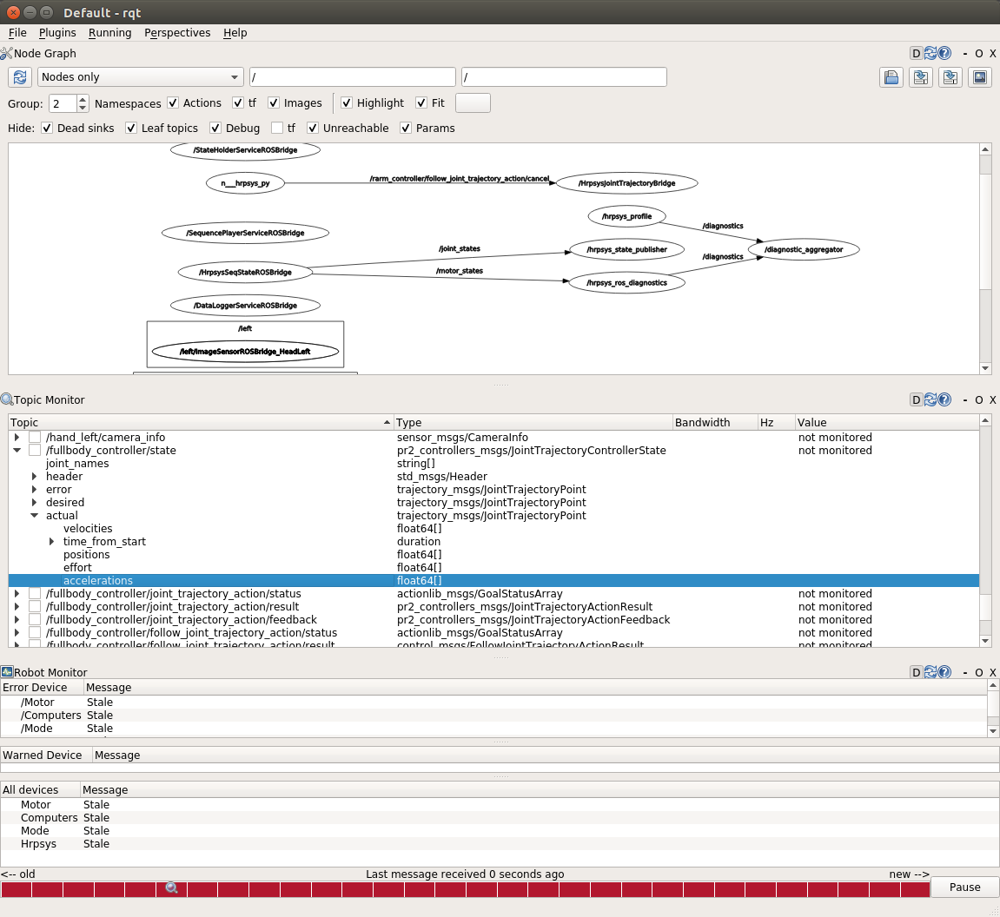

# トラブルシューティング

## RTM ステートのモニタリング<!--monitoring-the-rtm-state-->

以下の説明では「ROSサーバの起動」を実行した状態とします。

ロボットホスト上で動作しているRTコンポーネントのリストを取得するには `rtls` を利用します。

- 注意: 最後のスラッシュ `/` を忘れずに入力してください。

```
$ rtls %HOST_ROBOT%:15005/
```

> シミュレーションの場合の例
>
> ```
> $ rtls localhost:15005/
> ```
>
> NEXTAGE OPEN の場合の例（ホスト名をユーザの環境に合わせて変更してください）
>
> ```
> $ rtls nextage:15005/
> ```

`rtls` の実行例（シミュレーション）

```
$ rtls localhost:15005/
robotuser-PC.host_cxt/              StateHolderServiceROSBridge.rtc
fk.rtc                              DataLoggerServiceROSBridge.rtc
longfloor(Robot)0.rtc               ImageSensorROSBridge_HandLeft.rtc
sh.rtc                              HiroNX(Robot)0.rtc
ImageSensorROSBridge_HeadRight.rtc  seq.rtc
HrpsysJointTrajectoryBridge0.rtc    log.rtc
HGcontroller0.rtc                   sc.rtc
ModelLoader                         el.rtc
CollisionDetector0.rtc              ImageSensorROSBridge_HandRight.rtc
ImageSensorROSBridge_HeadLeft.rtc   HrpsysSeqStateROSBridge0.rtc
SequencePlayerServiceROSBridge.rtc  ForwardKinematicsServiceROSBridge.rtc
ic.rtc                              rmfo.rtc
```

`rtls` で得られたリストの各RTコンポーネントの情報を得るには `rtcat` を利用します。

<!-- ``` -->
<!-- $ rtls %HOST_ROBOT%:15005/%CONPONENT_NAME% -->
<!-- ``` -->

`rtcat` の実行例（シミュレーション）

```
$ rtcat localhost:15005/fk.rtc
fk.rtc  Active
  Category       example
  Description    forward kinematics component
  Instance name  fk
  Type name      ForwardKinematics
  Vendor         AIST
  Version        315.15.0
  Parent         
  Type           Monolithic
 +Extra properties
+Execution Context 0
+DataInPort: q
+DataInPort: sensorRpy
+DataInPort: qRef
+DataInPort: basePosRef
+DataInPort: baseRpyRef
+CorbaPort: ForwardKinematicsService

$ rtcat localhost:15005/StateHolderServiceROSBridge.rtc
StateHolderServiceROSBridge.rtc  Active
  Category       
  Description    
  Instance name  StateHolderServiceROSBridge
  Type name      StateHolderServiceROSBridge
  Vendor         
  Version        1.0.0
  Parent         
  Type           Monolithic
 +Extra properties
+Execution Context 0
+CorbaPort: StateHolderService

$ rtcat localhost:15005/ImageSensorROSBridge_HeadRight.rtc
ImageSensorROSBridge_HeadRight.rtc  Active
  Category       example
  Description    openrhp image - ros bridge
  Instance name  ImageSensorROSBridge_HeadRight
  Type name      ImageSensorROSBridge
  Vendor         Kei Okada
  Version        1.0
  Parent
  Type           Monolithic
 +Extra properties
+Execution Context 0
+DataInPort: image
+DataInPort: timedImage
robotuser@robotuser-PC:~$
```


## ROS ステートのモニタリング<!--monitoring-the-ros-state-->

### ROS 環境の確認<!--checking-the-ros-environments-->

#### ROS のバージョンの確認<!--checking-the-ros-version-->

```
$ rosversion -d
```

#### ROS に関する環境変数の確認<!--checking-the-ros-environment-variable-->

```
$ env | grep ROS
```

### rqt を用いたモニタリング<!--monitoring-with-rqt-->

ROS の rqt は開発時におけるデータの可視化に大変役立つツールセットです。
ここでは NEXTAGE OPEN において特に便利ないくつかのツールを紹介します。

- 参考: rqt/Plugins - ROS Wiki [http://wiki.ros.org/rqt/Plugins](http://wiki.ros.org/rqt/Plugins)

まず rqt を起動します。

```
$ rqt
```

次に "Plugins" をクリックして以下のプラグインを選択します。

- Introspection / Node Graph ( [rqt_graph](http://wiki.ros.org/rqt_graph) )
- Robot Tools / Diagnostics Viewer  
- Topics / Topic Monitor ( [rqt_topic](http://wiki.ros.org/rqt_topic) )

下図のようなウィンドウが表示されます。

- 注意: この画像はロボットモニタの診断が無効なシミュレータでキャプチャされたため、失効ステータスが表示されています。



## ROS Topicによる動作
ROS Topicを用いて関節の角度を指定することでロボットを動作せることができます。ただし、腰軸と腕を同時に動作させるTopicである`/rarm_torso_controller/command`と`/larm_torso_controller/command`を利用しないで下さい。腰軸と腕を同時に動作させたい場合は`/rarm_controller/command`、`/larm_controller/command`、`/torso_controller/command`を組み合わせて実行してください。

## 動作対象の指定
pythonインターフェースとrosserviceの`setJointAnglesOfGroup`で、引数の関節グループに`rarm_torso`または`larm_torso`（腰と腕の両方を含むグループ）を指定しないで下さい。腕と腰を動作させたい場合は腕と腰を分けて動作させてください。

## 実機動作でのトラブルシューティング
腕の動作時に腕が振動し、音が発生する場合があります。ロボットの運用に支障がある場合は動作速度の変更や動作軌道の変更してください。

## DiagnosisUI
DiagnosisUIの実行時に以下のエラーが発生する場合があります。

```
Failed to load module "canberra-gtk-module"
```

このエラーが発生してもDiagnosisUIは正常に動作しますが、libcanberra-gtk-moduleをインストールするとエラーを消すことができます。

```
$ sudo apt-get install libcanberra-gtk-module
```

## その他のトラブルシューティング<!--troubleshooting-with-qnx-->
[DiagnosisUIの使い方](manual_ja_tutorial_gui.html) を参照し、診断ログと非常停止ログを取得し、
サポートにお問い合わせください。

<!-- HIRO / NEXTAGE OPEN の QNX 内プロセスの状態を見るリモート監視ツールがないため、 -->
<!-- その状態を見るためには QNX コンピュータ上のログファイルの内容を見る必要があります。 -->

<!-- ### ログの回収<TODO ログインさせない場合どう取得する？> -->

<!-- QNX のログファイルは `/opt/jsk/var/log` にあります。 -->

<!-- - Nameserver.log -->
<!--   - OpenRTM または CORBA に関係したログの多くが記載 -->
<!-- - Modelloader.log -->
<!--   - OpenHRP3 に関するログ -->
<!-- - rtcd.log -->
<!--   - hrpsys のRTコンポーネントに関連したログ -->

<!-- これらのログファイルは次のいずれかの方法で取得することができます。 -->

<!-- ##### 【推奨】 ログファイルの zip ボールを取得するスクリプトを実行する -->

<!-- - 注意: rtmros_hironx 1.1.25 以降で利用可能 -->

<!-- ``` -->
<!-- # Simplest -->

<!-- $ rosrun hironx_ros_bridge qnx_fetch_log.sh nextage qnx_nxo_user -->
<!-- $ rosrun hironx_ros_bridge qnx_fetch_log.sh 192.168.128.10 root -->
<!-- : -->
<!-- $ ls -->
<!-- opt_jsk_var_logs_20170602-020236.zip -->

<!-- # Fetch only files generated after certain date. "1" can be anything except "archive" -->

<!-- $ rosrun hironx_ros_bridge qnx_fetch_log.sh nextage qnx_nxo_user 1 2017-01-11 -->
<!-- ``` -->

<!-- ##### 【代替】 QNX にリモート接続する -->

<!-- QNX コンピュータに SSH 接続をして、 -->
<!-- ディレクトリ `/opt/jsk/var/log` 下にあるログファイルにアクセスしてください。 -->

<!-- ### ログのチェック -->

<!-- #### ロボット肩LEDが電源投入後に緑色点灯状態にならない場合 -->

<!-- 電源投入後正常起動した場合はロボット肩LEDが緑色点灯する状態となります。 -->
<!-- それ以外の場合は QNX のログを確認してください。 -->

<!-- `/opt/jsk/var/log/rtcd.log` が次のようになってるかを確認してください。 -->

<!-- ``` -->
<!-- Logger::Logger: streambuf address = 0x805fc70 -->
<!-- hrpExecutionContext is registered -->
<!-- pdgains.file_name: /opt/jsk/etc/HIRONX/hrprtc/PDgains.sav -->
<!-- dof = 15 -->
<!-- open_iob - shmif instance at 0x80b3f58 -->
<!-- the number of gyros = 0 -->
<!-- the number of accelerometers = 0 -->
<!-- the number of force sensors = 0 -->
<!-- period = 5[ms], priority = 49 -->
<!-- ``` -->

<!-- `/opt/jsk/var/log/Nameserver.log` が次のようになってるかを確認してください。 -->

<!-- ``` -->
<!-- Sat Jan 24 10:55:33 2015: -->

<!-- Starting omniNames for the first time. -->
<!-- Wrote initial log file. -->
<!-- Read log file successfully. -->
<!-- Root context is IOR:010000002b00000049444c3a6f6d672e6f72672f436f734e616d696e672f4e616d696e67436f6e74 -->
<!-- 6578744578743a312e300000010000000000000070000000010102000d0000003139322e3136382e312e313600009d3a0b00 -->
<!-- 00004e616d6553657276696365000300000000000000080000000100000000545441010000001c0000000100000001000100 -->
<!-- 0100000001000105090101000100000009010100035454410800000095fbc2540100001b -->
<!-- Checkpointing Phase 1: Prepare. -->
<!-- Checkpointing Phase 2: Commit. -->
<!-- Checkpointing completed. -->

<!-- Sat Jan 24 11:10:33 2015: -->

<!-- Checkpointing Phase 1: Prepare. -->
<!-- Checkpointing Phase 2: Commit. -->
<!-- Checkpointing completed. -->
<!-- ``` -->

<!-- `/opt/jsk/var/log/ModelLoader.log` が次のようになっているかを確認してください。 -->

<!-- ``` -->
<!-- ready -->
<!-- loading /opt/jsk/etc/HIRONX/model/main.wrl -->
<!-- Humanoid node -->
<!-- Joint nodeWAIST -->
<!--   Segment node WAIST_Link -->
<!--   Joint nodeCHEST_JOINT0 -->
<!--     Segment node CHEST_JOINT0_Link -->
<!--     Joint nodeHEAD_JOINT0 -->
<!--       Segment node HEAD_JOINT0_Link -->
<!--       Joint nodeHEAD_JOINT1 -->
<!--         Segment node HEAD_JOINT1_Link -->
<!--         VisionSensorCAMERA_HEAD_R -->
<!--         VisionSensorCAMERA_HEAD_L -->
<!--     Joint nodeRARM_JOINT0 -->
<!--       Segment node RARM_JOINT0_Link -->
<!--       Joint nodeRARM_JOINT1 -->
<!--         Segment node RARM_JOINT1_Link -->
<!--         Joint nodeRARM_JOINT2 -->
<!--           Segment node RARM_JOINT2_Link -->
<!--           Joint nodeRARM_JOINT3 -->
<!--             Segment node RARM_JOINT3_Link -->
<!--             Joint nodeRARM_JOINT4 -->
<!--               Segment node RARM_JOINT4_Link -->
<!--               Joint nodeRARM_JOINT5 -->
<!--                 Segment node RARM_JOINT5_Link -->
<!--     Joint nodeLARM_JOINT0 -->
<!--       Segment node LARM_JOINT0_Link -->
<!--       Joint nodeLARM_JOINT1 -->
<!--         Segment node LARM_JOINT1_Link -->
<!--         Joint nodeLARM_JOINT2 -->
<!--           Segment node LARM_JOINT2_Link -->
<!--           Joint nodeLARM_JOINT3 -->
<!--             Segment node LARM_JOINT3_Link -->
<!--             Joint nodeLARM_JOINT4 -->
<!--               Segment node LARM_JOINT4_Link -->
<!--               Joint nodeLARM_JOINT5 -->
<!--                 Segment node LARM_JOINT5_Link -->
<!-- The model was successfully loaded ! -->
<!-- ``` -->

<!-- すべてのログが上記のような表示でしたらログに関しては正常で、 -->
<!-- 他に何か複雑なことが起こっている可能性があります。 -->
<!-- サポートにお問い合わせください。 -->


<!-- EOF -->
