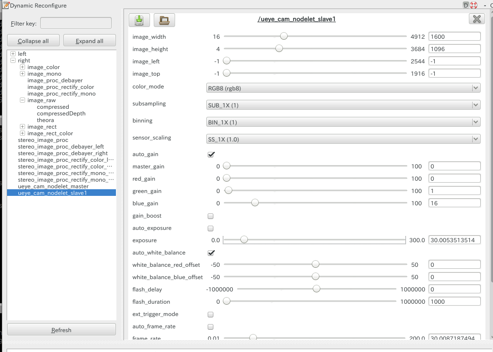

# チュートリアル: 3次元認識

## ロボット搭載カメラの設定<!--Robot camera settings-->

### NEXTAGE Fillie OPEN のカメラ<!--NEXTAGE Fillie OPEN cameras-->

NEXTAGE Fillie OPEN（HIRO ではない）は頭部に2つ、オプションで左右ハンドに1つずつの
合計4つの IDS社製 uEye カメラを搭載することができます。
それらのカメラの操作は ueye_cam パッケージにて行われ、基本的にそれは

- nextage_fillie_open_ros_bridge/launch/nextage_fillie_open_ueye_stereo.launch
- nextage_fillie_open_ros_bridge/launch/hands_ueye.launch

内にてまとめられています。


注意: HIRO のカメラについて
- 本項で記述されている内容は HIRO に搭載されているカメラに関するものではありません。
- HIRO のカメラを動作させる方法は本項で説明されている内容と異なる可能性があります。

### ユーザ独自のカメラの利用について<!--User-Specific Cameras-->

オプションで選択できるカメラ以外でも
ROS のドライバがあるものについては使用することができます。
既に ROS のドライバが存在しているカメラの情報は次のリンク先で知ることができます。

- Sensors/Cameras - ROS Wiki
  - [http://wiki.ros.org/Sensors/Cameras](http://wiki.ros.org/Sensors/Cameras)
  - 注意: 手作業で更新されているので全ての情報を網羅するものではありません。

ユーザによっては Kinect や Xtion カメラをロボット頭部に搭載して利用したりしています。
そのような場合には tf の確認や MoveIt! で衝突判定を行うのであれば、
カメラの 3D モデルなどを構築してロボットモデルを更新する必要があります。

### ヘッドカメラの設定<!--Head camera settings-->

#### uEye カメラノードの実行<!--Running the Ueye Camera Node-->

まずロボット頭部用カメラが頭部に設置されていることを確認してください。
ステレオカメラのノードを実行します。

```
$ source ~/<your_ueye_cam_ws>/devel/setup.bash
$ roslaunch nextage_fillie_open_ros_bridge nextage_fillie_open_ueye_stereo.launch
```

※ `$ source ~/<your_ueye_cam_ws>/devel/setup.bash`は事前に.bashrcに設定していれば省略できます。

このノードでは ueye_cam パッケージを利用していますので、
次のように映像トピックをサブスクライブ（購読）することができます。

```
$ rostopic echo left/image_raw
$ rostopic echo right/image_raw
```

映像は rqt_image_view などの GUI ツールを使用して見ることができます。

#### ステレオカメラのキャリブレーション<!--Calibration of the stereo camera-->

ステレオカメラを利用する前にはキャリブレーション作業が必要です。

- How to Calibrate a Stereo Camera - ROS Wiki
  - [http://wiki.ros.org/camera_calibration/Tutorials/StereoCalibration](http://wiki.ros.org/camera_calibration/Tutorials/StereoCalibration)

次のコマンドでステレオカメラのキャリブレーションを行います。

```
$ rosrun camera_calibration cameracalibrator.py --size 4x6 --square 0.024 --approximate=0.1 --camera_name=stereo_frame right:=/right/image_raw left:=/left/image_raw right_camera:=/right left_camera:=/left
```

キャリブレーション結果のデータは \<your home directory>/.ros/camera_info 内に保存してください。
このデータは消さないようにしてださい。

### ハンドカメラの設定 <!--Hand-Camera Setting--><!--todo 未テスト -->

次のコマンドにより左右ハンドに搭載されている合計2つのカメラを動作させます。

```
$ source ~/<your_ueye_cam_ws>/devel/setup.bash
$ roslaunch nextage_fillie_open_ros_bridge hands_ueye.launch
```

ハンドカメラの映像は次のトピックにより購読できます。

```
$ rostopic echo /left_hand_ueye/image_raw   (left)
$ rostopic echo /right_hand_ueye/image_raw  (right)
```

### カメラの設定<!--Camera settings-->
rqt_reconfigureを使ってカメラ設定を変更することができます。
```
$ rosrun rqt_reconfigure rqt_reconfigure
```


rqt_image_viewにてカメラ撮像を確認できます。
```
$ rosrun rqt_image_view rqt_image_view
```

<!-- EOF -->
