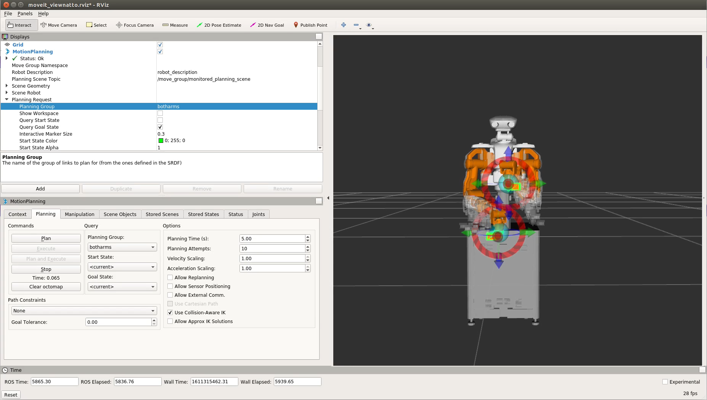
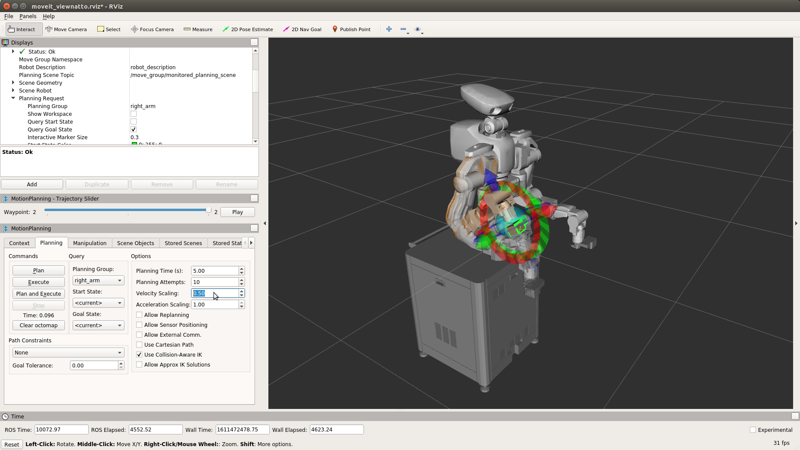

# Tutorial: MoveIt! GUI

## MoveIt!-ROS motion planning software

A representative software package for ROS's motion planning application is MoveIt!.
Since there is rtm_ros_bridge at NEXTAGE Fillie OPEN,
you can use MoveIt!'s motion planning functions.

## Working with the MoveIt! GUI

For basic operations, see "Performing MoveIt! Operations" in "Quick Start".

#### Switching to a left arm and two arms movement plan

When the MoveIt! is started in NEXTAGE Fillie OPEN, to create a motion schedule for the left arm using the left arm, change the MoveIt! settings as follow.

1. Select left_arm in the MotionPlanning →Plannning Request →Planning Group in the child window Displays

2. Operate the InteractiveMarker as with the right arm and click [Plan and Execute].


The NEXTAGE Fillie OPEN's MoveIt! also allows you to plan movements on both arms.<br>
On the MoveIt! GUI:RViz, choose:

1. Select botharms in the MotionPlanning →Plannning Request →Planning Group in the Displays.
2. Operate the InteractiveMarker on the arms and click [Plan and Execute].


#### Displaying Loop Animation and Trajectories in a Motion Plan

When an motion plan is created in the MoveIt!, the animations of the motion plan are displayed once.
In order to make it easier to check the motion plan, it is possible to display the motion animation repeatedly and display the trajectory.

Change the MoveIt! settings as follows:
1. Turn on the MotionPlanning →Planning Path →Loop Animation checkbox in the child window Displays.
2. Turn on the Show Trail checkbox immediately below the Loop Animation.

Viewing animations and trajectories in the MoveIt! (images are captured in the middle of animations)


#### Confirmation of each posture in the motion plan

To check the posture of an arbitrary elapsed point in the motion plan, which is difficult to check by loop animation
You use MotionPlanning-Slider.

1. Select a MotionPlanning-Slider in the MoveIt! menus Panels
2. After the motion plan is created, the slider is operated to display the posture of the elapsed point.


#### Adjustment of speed and acceleration of execution operation

In the Options on the Planning tabs in the MotionPlanning

- Velocity Scaling: 1.00
- Acceleration Scaling: 1.00

You can change the value between 0 and 1 to dynamically change the speed and acceleration of the operation.



#### Use of the best solution in a posture without an inverse kinematic solution

By defaulting the InteractiveMarker to posture without an inverse kinematic solution,
the end effector (e.g., hand tip) stops at the location of the solution.

In the Planning tab of the MotionPlanning child window,
if you check Approx IK Solutions,
even in a posture where there is no exact inverse kinematics solution, the near best solution is used.


## motion plans to avoid obstacles in  MoveIt! GUI

One of the biggest features of the MoveIt! is that it automatically generates operations that avoid obstacles.

### MoveIt! motion planning using obstacle model data

This section introduces how to read files of model
data into the MoveIt! and plan the operation of the model data　when the environment is known.

#### Reading Scene Files for Obstacle Models

Load the obstacle model file into the MoveIt! as follows:

1. Click [Import] on the Scene Objects tabs in the MotionPlanning.
2. Select nxo_pillar. scene and click OK.
3. If needed, manipulate the obstacle InteractiveMarker to move it close to the robots' hands
4. In the Scene Objects tabs, click [Publish] → Reflect obstacles to scenes.

- Obstacle model file
  - CATKIN_WORKSPACE  ~/catkin_ws/src/nextage_fillie_open_moveit_config/models/nxo_pillar.scene

Import<br>


Publish<br>


Content of the nxo_pillar.scene scene file

```
nxo_pillar
* nxo_pillar
1
box
0.1 0.1 1.1
0.4 -0.2 -0.42
0 0 0 1
0 0 0 0
.
```

#### motion plan for avoiding obstacles and execution thereof

Move the robot by performing an motion plan according to the environment of the loaded obstacle model.

Since the route to avoid the obstacle is automatically generated, the operation to plan the motion is the same as when there is no obstacle.

The following operation automatically generates a motion that avoids an obstacle and outputs the motion to the robot.

 - Note: the robot moves.

1. Turn the Select Start State to < current > of the Planning tabs Query.
2. Turn the Select Goal State to < current > of the Planning tabs Query.
3. Dragging a robotic hand from its present position to the other side of the obstacle with a InteractiveMarker on the MoveIt!
4. Click [Plan & Execute] on the Planning tab Commands.


Example of an Motion Plan to Avoid Obstacles


Example of an Motion Plan in the Non-Obstacle Case


#### Using STL /COLLADA Model Files

MoveIt! also has the ability to import files from STL or COLLADA models.<br>
Load the obstacle model file into the MoveIt! as follows:

1. On the Scene Objects tab in MotionPlanning, select 'Mesh from file' in the drop-down list under 'Add/Remove Scene Objects' and click the [ + ] button.
2. Select File tsubo.dae or File tsubo.stl and click [OK].
3. If needed, manipulate the obstacle InteractiveMarker to move it close to the robots' hands
4. In the Scene Objects tabs, click [Publish] → Reflect obstacles to scenes.

- STL /COLLADA model file
  - CATKIN_WORKSPACE  ~/catkin_ws/src/nextage_fillie_open_moveit_config/models/tsubo.*


Even with the STL /COLLADA model file,
you can create motion plans to avoid obstacles in the MoveIt!
in the same way as when reading a scene file.

Motion Planning - tsubo.stl


<!-- EOF -->
