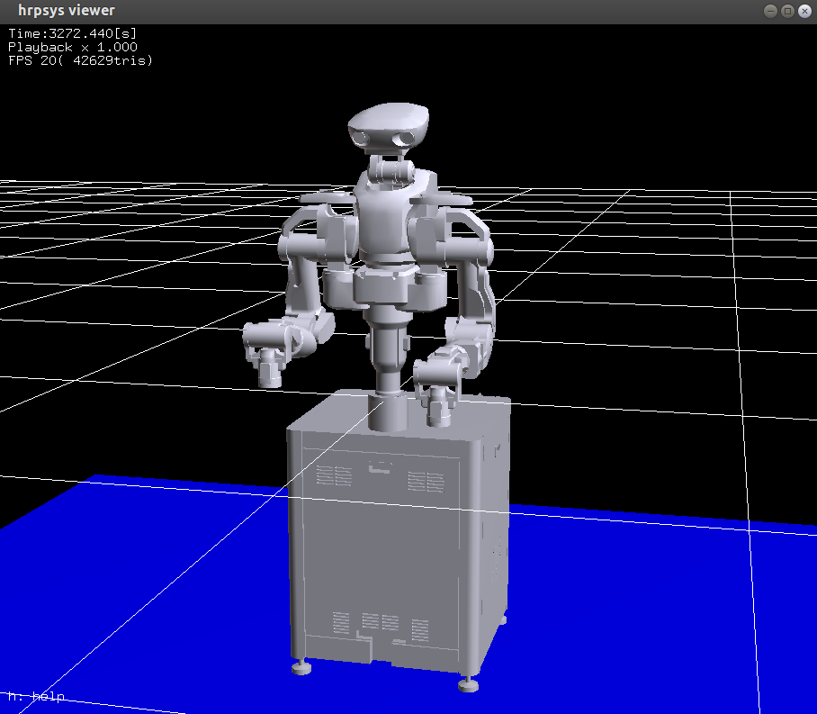
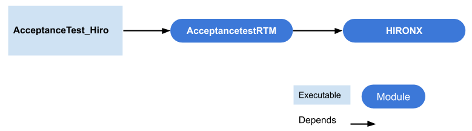

# Tutorial: Python interfaces

## RTM Python interfaces

### Interactive mode of operation

#### Startting MoveIt

Start Move It! in advance.

```
$ roslaunch nextage_fillie_open_moveit_config moveit_planning_execution.launch
```

#### Starting rtm_ros_bridge

Start rtm_ros_bridge.

```
$ roslaunch nextage_fillie_open_ros_bridge nextage_fillie_open_ros_bridge_real.launch nameserver:=%HOSTNAME%
```

#### Starting the iPython interfaces

Start the iPython interfaces on the NEXTAGE OPEN.
Change the host name according to the settings of each robot.

```
$ ipython -i `rospack find nextage_fillie_open_ros_bridge`/script/ nextage_fillie_open.py
(Simulation)

$ ipython -i `rospack find nextage_fillie_open_ros_bridge`/script/ nextage_fillie_open.py  -- --host nextage  
(Real Robot Example)
```

Other options can also be specified if necessary.

```
$ ipython -i `rospack find nextage_fillie_open_ros_bridge`/script/ nextage_fillie_open.py -- \
 --modelfile /opt/jsk/etc/FILLIE/model/main.wrl --host nextage --port 15005
```

Remote connections require the use of the `--robot` arguments to specify the instantiation names of robots.
For example, specify and execute as follow.

```
$ ipython -i `rospack find nextage_fillie_open_ros_bridge`/scripts/ nextage_fillie_open.py -- \
 --host nxo_simulation_host --robot "RobotHardware0"
```
To initialize iPython interfaces, do the following:

- Detect RTCManager and RobotHardware
  - RTCManager: the OpenRTM classes that invoke the RT component
  - RobotHardware: RT components defined in hrpsys, which interfaces with robotic hardware
- Connections and activations to the RT components are required to operate hrpsys controllers
- Start the logger
- Assigning joint groups (HIRO/NEXTAGE OPEN specific)

#### Common RTM Python interface commands

This section introduces commands specific to the actual operation of the robot.

- Note-1: Execution of the command moves the robot.
- Note-2: Keep the emergency stop switch in a state where it can be pushed at any time.

This is a command for calibrating the actual robot machine.

```
In [0] : robot.checkEncoders()
```

- This function is performed only when the actual robot needs to be recalibrated (LED blinks blue).
  <!-- - ほとんどの場合においてロボット胸部の緑のロボットステートインジケータライトが点滅します。 -->

This is a command to set the robot to the initial position.

```
In [0] : robot.goInitial()
```

<!-- 作業終了姿勢に移行するコマンドです。終了姿勢に移行した後にサーボが切れます。 -->

<!-- ``` -->
<!-- In [0] : robot.goOffPose() -->
<!-- ``` -->

<!-- - システムの再起動・シャットダウン時の前にはこのコマンドを実行してください。 -->

This is the command to turn on the servo.

```
In [0] : robot.servoOn()
```

- the servo must be turned on manually when the servo is turned off after performing the following operations.
  - When the Emergency Stop switch is pressed (in this case, `servoOff` must be performed first).
  - When an Emergency Stop occurs due to an abnormal movement of the robot.
- When the joint angle and the current angle command value are different, the robot will move rapidly toward the command value if the servo is turned on by the above command. Please be sure to execute either of the following operations immediately before turn on the servo.
  - Press the [Suspend Resume] button in the DiagnosisUI.
  - Execute `robot.goActual()`.


This command turns off the servo.

```
In [0] : robot.servoOff()
```

 - If you press the Emergency Stop switch instead of turning off the servo, execute this command.

#### Using RTM Python Interfaces

When the iPython is initialized, the robotic client interface class NextageFillieOpenClient is instantiated on the iPython terminals as `robot`.

Let's look at what we can do in `robot`.

```
In [0] : robot.
```

Selectable items are displayed when the tab key is pressed even if the key is entered on the iPython terminal as described above.

```
robot.Groups              robot.getCurrentRPY         robot.rh_svc
robot.HandClose           robot.getCurrentRotation    robot.saveLog
robot.HandGroups          robot.getJointAngles        robot.sc
robot.HandOpen            robot.getRTCInstanceList    robot.sc_svc
robot.InitialPose         robot.getRTCList            robot.sensors
robot.OffPose             robot.getReferencePose      robot.seq
robot.RtcList             robot.getReferencePosition  robot.seq_svc
robot.abc                 robot.getReferenceRPY       robot.servoOff
robot.activateComps       robot.getReferenceRotation  robot.servoOn
robot.afs                 robot.getSensors            robot.setHandEffort
robot.checkEncoders       robot.goActual              robot.setHandJointAngles
robot.clearLog            robot.goInitial             robot.setHandWidth
robot.co                  robot.goOffPose             robot.setJointAngle
robot.co_svc              robot.hand_width2angles     robot.setJointAngles
robot.configurator_name   robot.hgc                   robot.setJointAnglesOfGroup
robot.connectComps        robot.ic                    robot.setSelfGroups
robot.connectLoggerPort   robot.init                  robot.setTargetPose
robot.createComp          robot.isCalibDone           robot.setupLogger
robot.createComps         robot.isServoOn             robot.sh
robot.el                  robot.kf                    robot.sh_svc
robot.el_svc              robot.lengthDigitalInput    robot.simulation_mode
robot.ep_svc              robot.lengthDigitalOutput   robot.st
robot.findModelLoader     robot.liftRobotUp           robot.stOff
robot.fk                  robot.loadPattern           robot.tf
robot.fk_svc              robot.log                   robot.vs
robot.flat2Groups         robot.log_svc               robot.waitForModelLoader
robot.getActualState      robot.moveHand              robot.waitForRTCManagerAndRoboHardware
robot.getBodyInfo         robot.ms                    robot.waitInterpolation
robot.getCurrentPose      robot.readDigitalInput      robot.waitInterpolationOfGroup
robot.getCurrentPosition  robot.rh                    robot.writeDigitalOutput
```

Look at `Groups` lists and their members.

```
In [0] : robot.Groups
Out:
[['torso', ['CHEST_JOINT0']],
 ['head', ['HEAD_JOINT0', 'HEAD_JOINT1']],
 ['rarm',
  ['RARM_JOINT0',
   'RARM_JOINT1',
   'RARM_JOINT2',
   'RARM_JOINT3',
   'RARM_JOINT4',
   'RARM_JOINT5']],
 ['larm',
  ['LARM_JOINT0',
   'LARM_JOINT1',
   'LARM_JOINT2',
   'LARM_JOINT3',
   'LARM_JOINT4',
   'LARM_JOINT5']]]
```

The benefit of iPython as a scripting interrupter is that it gets the API.

For example, even if you want to know the robot's current posture but don't know the command,
You can obtain the following information by first guessing a little and then using tab supplementation:

```
In [0] : robot.getCurrent
robot.getCurrentPose  obot.getCurrentPosition  robot.getCurrentRPY  robot.getCurrentRotation
```

Of these commands, `getCurrentPose` is the intended command.
If you also need to know the arguments for that method,
enter `?` at the end of the command.

```
In [0] : robot.getCurrentPose?
```

```
Signature: robot.getCurrentPose(lname=None, frame_name=None)
Docstring:
!@brief
Returns the current physical pose of the specified joint.
cf. getReferencePose that returns commanded value.

eg.
^Kerbatim
     IN: robot.getCurrentPose('LARM_JOINT5')
     OUT: [-0.0017702356144599085,
      0.00019034630541264752,
      -0.9999984150158207,
      0.32556275164378523,
      0.00012155879975329215,
      0.9999999745367515,
       0.0001901314142046251,
       0.18236394191140365,
       0.9999984257434246,
       -0.00012122202968358842,
       -0.001770258707652326,
       0.07462472659364472,
       0.0,
       0.0,
       0.0,
       1.0]
\endverbatim

@type lname: str
@param lname: Name of the link.
@param frame_name str: set reference frame name (from 315.2.5)
@rtype: list of float
@return: Rotational matrix and the position of the given joint in
         1-dimensional list, that is:
^Kerbatim
         [a11, a12, a13, x,
          a21, a22, a23, y,
          a31, a32, a33, z,
           0,   0,   0,  1]
\endverbatim
File:      /opt/ros/melodic/lib/python2.7/dist-packages/hironx_ros_bridge/hironx_client.py
Type:      instancemethod
```

Here, we can see that `getCurrentPose` accepts `lname`(link name's abbreviation....
So do the following:

```
In: robot.getCurrentPose('RARM_JOINT0')
Out:
[1.0,
 -3.3881317890172014e-21,
 0.0,
 0.04,
 3.3881317890172014e-21,
 1.0,
 0.0,
 -0.135,
 0.0,
 0.0,
 1.0,
 0.36850000000000005,
 0.0,
 0.0,
 0.0,
 1.0]
```

The `getCurrentPose` returns the rotational matrices and position values of the indicated links as one-dimensional lists.

If you want to know only the position, you can also obtain it by the following method.

```
In: robot.getCurrent
robot.getCurrentPose  robot.getCurrentPosition  robot.getCurrentRPY  robot.getCurrentRotation

In [0] : robot.getCurrentPosition('RARM_JOINT0')
Out: [0.04, -0.135, 0.36850000000000005]

```

In hrpsys, the position vector is represented by three corresponding elements [x, y, z] as follows:

- x: Previous
- y: left
- z: Top

---

Next, move your arm.
First, move to the initial position.

```
In [0] : robot.goInitial()
```

Determine how to set the target attitude.

```
In [0]: robot.setTargetPose?
Signature: robot.setTargetPose(gname, pos, rpy, tm, frame_name=None)
Docstring:
!@brief
Move the end-effector to the given absolute pose.
All d* arguments are in meter.

@param gname str: Name of the joint group. Case-insensitive
@param pos list of float: In meter.
@param rpy list of float: In radian.
@param tm float: Second to complete the command.
@param frame_name str: Name of the frame that this particular command
                   references to.
@return bool: False if unreachable.
File:      /opt/ros/melodic/lib/python2.7/dist-packages/hironx_ros_bridge/hironx_client.py
Type:      instancemethod
```

`gname` is the name of `joint group`.
`pos` and `rpy` are listed.

Store the current robot attitude in a variable before specifying the target attitude.

```
In [0] : pos = robot.getCurrentPosition('RARM_JOINT5')
In [0] : rpy = robot.getReferenceRPY('RARM_JOINT5')
In [0] : tm = 3
```

The posture of the robot is as shown below.


Now let's change the target position a little from the current position, and let's move to it.

```
In [0] : pos[2] = 0.1

In [0] : robot.setTargetPose('rarm', pos, rpy, tm)
Out: True
```

The hand of the right arm moves to the specified position as shown in the following figure.



<!-- ロボットでの作業が終了したら終了姿勢にしてください. -->
<!-- ``` -->
<!-- In [0] : robot.goOffPose() -->
<!-- ``` -->

<!--  -->

#### hrpsys-based API sources and documents

Hrpsys-based API has sources and documents linked to:

- Many commands are defined in the parent classes of the hrpsys_config. HrpsysConfigurator.
  - [http://fkanehiro.github.io/hrpsys-base/df/d98/
  classpython_1_1hrpsys__config_1_1HrpsysConfigurator.html](http://fkanehiro.github.io/hrpsys-base/df/d98/classpython_1_1hrpsys__config_1_1HrpsysConfigurator.html)
- HIRO:
  - [https://github.com/start-jsk/rtmros_hironx/blob/hydro-devel/hironx_ros_bridge/src/hironx_ros_bridge/hironx_client.py](https://github.com/start-jsk/rtmros_hironx/blob/hydro-devel/hironx_ros_bridge/src/hironx_ros_bridge/hironx_client.py)
- NEXTAGE Fillie OPEN:
  - ~/catkin_ws/src/nextage_fillie_open_ros_bridge/src/nextage_fillie_open_ros_bridge/nextage_fillie_open_client.py


### RTM Python interface programming

HIRO /NEXTAGE Fillie OPEN can be programmed using Python with one integrated interface.
The interface names differ from robot to robot.

- HIRONX :HIRO/HIRONX user
- NextageFillieOpenClient  :NEXTAGE Fillie OPEN user

This section uses "HIRONX" but NEXTAGE Fillie OPEN users can do the same using NextageFillieOpenClient interfaces.

#### Sample Code-Acceptance Test (RTM)

RTMPython interface programming with reference to Acceptance Test (RTM) codes.
Run the code after looking at the method.

##### acceptancetest_rtm.py

This sample has a two-step dependency relationship as shown in the figure below.



The behavior of this sample code is described in the `AcceptanceTest_Hiro` class.
Use the `AcceptancetestRTM` class to connect to the `HIRONX` class.

Let's look at `AcceptancetestRTM`.

- [https://raw.githubusercontent.com/start-jsk/rtmros_hironx/  
  a7a43e5baf4dcd48e34b94f9781defadfbca03d0/hironx_ros_bridge/  
  src/hironx_ros_bridge/testutil/acceptancetest_rtm.py](https://raw.githubusercontent.com/start-jsk/rtmros_hironx/a7a43e5baf4dcd48e34b94f9781defadfbca03d0/hironx_ros_bridge/src/hironx_ros_bridge/testutil/acceptancetest_rtm.py)

```python
1 # -*- coding: utf-8 -*-
2
3 # Software License Agreement (BSD License)
4 #
5 # Copyright (c) 2014, TORK (Tokyo Opensource Robotics Kyokai Association)
6 # All rights reserved.
7 #
8 # Redistribution and use in source and binary forms, with or without
9 # modification, are permitted provided that the following conditions
10 # are met:
11 #
12 #  * Redistributions of source code must retain the above copyright
13 #    notice, this list of conditions and the following disclaimer.
14 #  * Redistributions in binary form must reproduce the above
15 #    copyright notice, this list of conditions and the following
16 #    disclaimer in the documentation and/or other materials provided
17 #    with the distribution.
18 #  * Neither the name of TORK. nor the
19 #    names of its contributors may be used to endorse or promote products
20 #    derived from this software without specific prior written permission.
21 #
22 # THIS SOFTWARE IS PROVIDED BY THE COPYRIGHT HOLDERS AND CONTRIBUTORS
23 # "AS IS" AND ANY EXPRESS OR IMPLIED WARRANTIES, INCLUDING, BUT NOT
24 # LIMITED TO, THE IMPLIED WARRANTIES OF MERCHANTABILITY AND FITNESS
25 # FOR A PARTICULAR PURPOSE ARE DISCLAIMED. IN NO EVENT SHALL THE
26 # COPYRIGHT OWNER OR CONTRIBUTORS BE LIABLE FOR ANY DIRECT, INDIRECT,
27 # INCIDENTAL, SPECIAL, EXEMPLARY, OR CONSEQUENTIAL DAMAGES (INCLUDING,
28 # BUT NOT LIMITED TO, PROCUREMENT OF SUBSTITUTE GOODS OR SERVICES;
29 # LOSS OF USE, DATA, OR PROFITS; OR BUSINESS INTERRUPTION) HOWEVER
30 # CAUSED AND ON ANY THEORY OF LIABILITY, WHETHER IN CONTRACT, STRICT
31 # LIABILITY, OR TORT (INCLUDING NEGLIGENCE OR OTHERWISE) ARISING IN
32 # ANY WAY OUT OF THE USE OF THIS SOFTWARE, EVEN IF ADVISED OF THE
33 # POSSIBILITY OF SUCH DAMAGE.
34
35 import time
36
37 from hironx_ros_bridge.constant import Constant
38 from hironx_ros_bridge.testutil.abst_acceptancetest import AbstAcceptanceTest
39
40
41 class AcceptanceTestRTM(AbstAcceptanceTest):
42
43     def __init__(self, robot_client):
44         '''
45         @type robot_client: hironx_ros_bridge.hironx_client.HIRONX
46         '''
47         self._robotclient = robot_client
48
49     def go_initpos(self):
50         self._robotclient.goInitial()
51
52     def set_joint_angles(self, joint_group, joint_angles, msg_tasktitle=None,
53                          task_duration=7.0, do_wait=True):
54         '''
55         @see: AbstAcceptanceTest.set_joint_angles
56         '''
57         print("== RTM; {} ==".format(msg_tasktitle))
58         self._robotclient.setJointAnglesOfGroup(
59                          joint_group, joint_angles, task_duration, do_wait)
60
61     def set_pose(self, joint_group, pose, rpy, msg_tasktitle,
62                       task_duration=7.0, do_wait=True, ref_frame_name=None):
63
64         print("== RTM; {} ==".format(msg_tasktitle))
65         self._robotclient.setTargetPose(joint_group, pose, rpy, task_duration,
66                                         ref_frame_name)
67         if do_wait:
68             self._robotclient.waitInterpolationOfGroup(joint_group)
69
70     def set_pose_relative(
71                         self, joint_group, dx=0, dy=0, dz=0, dr=0, dp=0, dw=0,
72                         msg_tasktitle=None, task_duration=7.0, do_wait=True):
73         if joint_group == Constant.GRNAME_LEFT_ARM:
74             eef = 'LARM_JOINT5'
75         elif joint_group == Constant.GRNAME_RIGHT_ARM:
76             eef = 'RARM_JOINT5'
77
78         print("== RTM; {} ==".format(msg_tasktitle))
79         self._robotclient.setTargetPoseRelative(
80                                     joint_group, eef, dx, dy, dz, dr, dp, dw,
81                                     task_duration, do_wait)
82
83     def _run_tests_hrpsys(self):
84         '''
85         @deprecated: This method remains as a reference. This used to function
86                      when being called directly from ipython commandline and
87                      now replaced by optimized codes.
88         '''
89         _TIME_SETTARGETP_L = 3
90         _TIME_SETTARGETP_R = 2
91         _TIME_BW_TESTS = 5
92
93         self.robot.goInitial()
94
95         # === TASK-1 ===
96         # L arm setTargetPose
97         _POS_L_INIT = self.robot.getCurrentPosition('LARM_JOINT5')
98         _POS_L_INIT[2] += 0.8
99         _RPY_L_INIT = self.robot.getCurrentRPY('LARM_JOINT5')
100         self.robot.setTargetPose('larm', _POS_L_INIT, _RPY_L_INIT, _TIME_SETTARGETP_L)
101         self.robot.waitInterpolationOfGroup('larm')
102
103         # R arm setTargetPose
104         _POS_R_INIT = self.robot.getCurrentPosition('RARM_JOINT5')
105         _POS_R_INIT[2] -= 0.07
106         _RPY_R_INIT = self.robot.getCurrentRPY('RARM_JOINT5')
107         self.robot.setTargetPose('rarm', _POS_R_INIT, _RPY_R_INIT, _TIME_SETTARGETP_R)
108         self.robot.waitInterpolationOfGroup('rarm')
109         time.sleep(_TIME_BW_TESTS)
110
111         # === TASK-2 ===
112         self.robot.goInitial()
113         # Both arm setTargetPose
114         _Z_SETTARGETP_L = 0.08
115         _Z_SETTARGETP_R = 0.08
116         self.robot.setTargetPoseRelative('larm', 'LARM_JOINT5',
117                                          dz=_Z_SETTARGETP_L,
118                                          tm=_TIME_SETTARGETP_L, wait=False)
119         self.robot.setTargetPoseRelative('rarm', 'RARM_JOINT5',
120                                          dz=_Z_SETTARGETP_R,
121                                          tm=_TIME_SETTARGETP_R, wait=False)
122
123         # === TASK-3 ===
124         # Head toward down
125         _TIME_HEAD = 5
126         self.robot.setTargetPoseRelative('head', 'HEAD_JOINT0', dp=0.1, tm=_TIME_HEAD)
127         self.robot.waitInterpolationOfGroup('head')
128         # Head toward up
129         self.robot.setTargetPoseRelative('head', 'HEAD_JOINT0', dp=-0.2, tm=_TIME_HEAD)
130         self.robot.waitInterpolationOfGroup('head')
131         # See left by position
132         self.robot.setJointAnglesOfGroup('head', [50, 10], 2, wait=True)
133         # See right by position
134         self.robot.setJointAnglesOfGroup('head', [-50, -10], 2, wait=True)
135         # Set back face to the starting pose w/o wait.
136         self.robot.setJointAnglesOfGroup( 'head', [0, 0], 2, wait=False)
137
138         # === TASK-4 ===
139         # 0.1mm increment is not working for some reason.
140         self.robot.goInitial()
141         # Move by iterating 0.1mm at cartesian space
142         _TIME_CARTESIAN = 0.1
143         _INCREMENT_MIN = 0.0001
144         for i in range(300):
145             self.robot.setTargetPoseRelative('larm', 'LARM_JOINT5',
146                                              dy=_INCREMENT_MIN,
147                                              tm=_TIME_CARTESIAN)
148             self.robot.setTargetPoseRelative('rarm', 'RARM_JOINT5',
149                                              dy=_INCREMENT_MIN,
150                                              tm=_TIME_CARTESIAN)
151             print('{}th move'.format(i))
152
153         self.robot.goInitial()
154         # === TASK-5 ===
155         # Turn torso
156         _TORSO_ANGLE = 120
157         _TIME_TORSO_R = 7
158         self.robot.setJointAnglesOfGroup('torso', [_TORSO_ANGLE], _TIME_TORSO_R, wait=True)
159         self.robot.waitInterpolationOfGroup('torso')
160         self.robot.setJointAnglesOfGroup('torso', [-_TORSO_ANGLE], 10, wait=True)
161
162         self.robot.goInitial()
163
164         # === TASK-6.1 ===
165         # Overwrite previous command, for torso using setJointAnglesOfGroup
166         self.robot.setJointAnglesOfGroup('torso', [_TORSO_ANGLE], _TIME_TORSO_R,
167                                          wait=False)
168         time.sleep(1)
169         self.robot.setJointAnglesOfGroup('torso', [-_TORSO_ANGLE], 10, wait=True)
170
171         self.robot.goInitial(5)
172
173         # === TASK-6.2 ===
174         # Overwrite previous command, for arms using setTargetPose
175         _X_EEF_OVERWRITE = 0.05
176         _Z_EEF_OVERWRITE = 0.1
177         _TIME_EEF_OVERWRITE = 7
178         _POS_L_INIT[0] += _X_EEF_OVERWRITE
179         _POS_L_INIT[2] += _Z_EEF_OVERWRITE
180         self.robot.setTargetPose('larm', _POS_L_INIT, _RPY_L_INIT, _TIME_EEF_OVERWRITE)
181         self.robot.waitInterpolationOfGroup('larm')
182         # Trying to raise rarm to the same level of larm.
183         _POS_R_INIT[0] += _X_EEF_OVERWRITE
184         _POS_R_INIT[2] += _Z_EEF_OVERWRITE
185         self.robot.setTargetPose('rarm', _POS_R_INIT, _RPY_R_INIT, _TIME_EEF_OVERWRITE)
186         self.robot.waitInterpolationOfGroup('rarm')
187         time.sleep(3)
188         # Stop rarm
189         self.robot.clearOfGroup('rarm')  # Movement should stop here.
190
191         # === TASK-7.1 ===
192         # Cover wide workspace.
193         _TIME_COVER_WORKSPACE = 3
194         # Close to the max width the robot can spread arms with the hand kept
195         # at table level.
196         _POS_L_X_NEAR_Y_FAR = [0.32552812002303166, 0.47428609880442024, 1.0376656470275407]
197         _RPY_L_X_NEAR_Y_FAR = (-3.07491977663752, -1.5690249316560323, 3.074732073335767)
198         _POS_R_X_NEAR_Y_FAR = [0.32556456455769633, -0.47239119592815987, 1.0476131608682244]
199         _RPY_R_X_NEAR_Y_FAR = (3.072515432213872, -1.5690200270375372, -3.072326882451363)
200
201         # Close to the farthest distance the robot can reach, with the hand kept
202         # at table level.
203         _POS_L_X_FAR_Y_FAR = [0.47548142379781055, 0.17430276793604782, 1.0376878025614884]
204         _RPY_L_X_FAR_Y_FAR = (-3.075954857224205, -1.5690261926181046, 3.0757659493049574)
205         _POS_R_X_FAR_Y_FAR = [0.4755337947019357, -0.17242322190721648, 1.0476395479774052]
206         _RPY_R_X_FAR_Y_FAR = (3.0715850722714944, -1.5690204449882248, -3.071395243174742)
207         self.robot.setTargetPose('larm', _POS_L_X_NEAR_Y_FAR, _RPY_L_X_NEAR_Y_FAR, _TIME_COVER_WORKSPACE)
208         self.robot.setTargetPose('rarm', _POS_R_X_NEAR_Y_FAR, _RPY_R_X_NEAR_Y_FAR, _TIME_COVER_WORKSPACE)
209         self.robot.waitInterpolationOfGroup('larm')
210         self.robot.waitInterpolationOfGroup('rarm')
211         time.sleep(3)
212         self.robot.setTargetPose('larm', _POS_L_X_FAR_Y_FAR, _RPY_L_X_FAR_Y_FAR, _TIME_COVER_WORKSPACE)
213         self.robot.setTargetPose('rarm', _POS_R_X_FAR_Y_FAR, _RPY_R_X_FAR_Y_FAR, _TIME_COVER_WORKSPACE)
214         self.robot.waitInterpolationOfGroup('larm')
215         self.robot.waitInterpolationOfGroup('rarm')
216
217         self.robot.goInitial()
```

Look at the contents of the task.

```python
37 from hironx_ros_bridge.constant import Constant
38 from hironx_ros_bridge.testutil.abst_acceptancetest import AbstAcceptanceTest
```

The HIRONX or NextageFillieClient classes of the RTM API have not been imported.
However, looking at the next part,


```python
43 def __init__(self, robot_client):
44     '''
45     @type robot_client: hironx_ros_bridge.hironx_client.HIRONX
46     '''
47     self._robotclient = robot_client
```

You can see that the constructor receives the HIRONX and stores it in the members `self._robotclient`.
'self._robotclient' will refer to the HIRONX class instance.

The rest of the code is performing basic operations only.

For example:
Briefly, all joints are described in the initial posture.

```python
49 def go_initpos(self):
50     self._robotclient.goInitial()
```

> As you develop your code later,
You may want to know the options by looking at the API documents of the classes and methods.
This tutorial will not be described in detail. Please try to explore it by yourself.
For example, the `goInitial` method has the following options:
```python
def hironx_ros_bridge.hironx_client.HIRONX.goInitial(self, tm = 7, wait = True, init_pose_type = 0)
```
- [http://docs.ros.org/hydro/api/hironx_ros_bridge/html/
classhironx__ros__bridge_1_1hironx__client_1_1HIRONX.html
#a295b0b4950cb580273b224dc659c8a23](http://docs.ros.org/hydro/api/hironx_ros_bridge/html/classhironx__ros__bridge_1_1hironx__client_1_1HIRONX.html#a295b0b4950cb580273b224dc659c8a23)

A further example is the following.

```python
52     def set_joint_angles(self, joint_group, joint_angles, msg_tasktitle=None,
53                          task_duration=7.0, do_wait=True):
54         '''
55         @see: AbstAcceptanceTest.set_joint_angles
56         '''
57         print("== RTM; {} ==".format(msg_tasktitle))
58         self._robotclient.setJointAnglesOfGroup(
59                          joint_group, joint_angles, task_duration, do_wait)
```

We simply call the HIRONX method,
Since much has already been processed in the HIRONX ,
You can write code in this simple way.

##### Sample code execution

Open new iPython terminals.
At least three terminals are open.
Start the iPython terminals as follow.
In the case of a simulation environment, start the system accordingly.

```
$ ipython -i `rospack find hironx_ros_bridge`/scripts/acceptancetest_hironx.py -- --host %HOSTNAME%
```

The following commands perform tasks through the RTM interfaces:

- Note: **Robot moves.**

```
In [0] : acceptance.run_tests_rtm()
```

You can also execute tasks sequentially by describing them as follows.

```
In [0] : acceptance.run_tests_rtm(do_wait_input=True)
```

To exit the iPython interfaces, escape with `Ctrl-d`.

#### Sample code-draw a circle

A sample code that draws a circle with the robot's end effector is shown below.

- Note: **When modifying this code, check the operation of this code by simulation and then operate it on the actual machine.**


Previous model simulation animation:
[NEXTAGE OPEN] Robots hands drawing circles: [https://www.youtube.com/watch?v=OVae1xa5Rak](https://www.youtube.com/watch?v=OVae1xa5Rak)

<!-- 変数 `robot` は何らかの方法でユーザの NextageAClient クラスのインスタンスに置き換える必要があります。 -->

Execute with the following commands.
Where %HOST% refers to robotic IP addresses.
```
$ ipython -i `rospack find nextage_fillie_open_ros_bridge`/script/nextage_fillie_open.py -- --host %HOST%(real machine)
$ ipython -i `rospack find nextage_fillie_open_ros_bridge`/script/nextage_fillie_open.py(simulation)
In [0] : execfile('/home/nxouser/catkin_ws/src/nextage_fillie_open_ros_bridge/script/circle.py')
```

```python
def circle_eef(radius=0.01, eef='larm', step_degree=5, ccw=True, duration=0.1):
    '''
    Moves the designated eef point-by-point so that the trajectory as a whole draws a circle.

    Currently this only works on the Y-Z plane of *ARM_JOINT5 joint.
    And it's the most intuitive when eef maintains a "goInitial" pose where circle gets drawn on robot's X-Y plane
    (see the wiki for the robot's coordinate if you're confused http://wiki.ros.org/rtmros_nextage/Tutorials/Programming#HiroNXO_3D_model_coordination).

    Points on the circular trajectory is based on a standard equation https://en.wikipedia.org/wiki/Circle#Equations

    @param radius: (Unit: meter) Radius of the circle to be drawn.
    @param step_degree: Angle in degree each iteration increments.
    @param ccw: counter clock-wise.
    @param duration: Time for each iteration to be completed.
    '''
    goal_deg = GOAL_DEGREE = 360
    start_deg = 0
    if eef == 'larm':
        joint_eef = 'LARM_JOINT5'
    elif eef == 'rarm':
        joint_eef = 'RARM_JOINT5'
    eef_pos = robot.getCurrentPosition(joint_eef)
    eef_rpy = robot.getCurrentRPY(joint_eef)
    print('eef_pos={}'.format(eef_pos))
    X0 = eef_pos[0]
    Y0 = eef_pos[1]
    ORIGIN_x = X0
    ORIGIN_y = Y0 - radius
    print('ORIGIN_x={} ORIGIN_y={}'.format(ORIGIN_x, ORIGIN_y))
    i = 0
    for theta in range(start_deg, goal_deg, step_degree):
        if not ccw:
            theta = -theta
        x = ORIGIN_x + radius*math.sin(math.radians(theta))  # x-axis in robot's eef space is y in x-y graph
        y = ORIGIN_y + radius*math.cos(math.radians(theta))
        eef_pos[0] = x
        eef_pos[1] = y
        print('#{}th theta={} x={} y={} X0={} Y0={}'.format(i, theta, x, y, X0, Y0))
        robot.setTargetPose(eef, eef_pos, eef_rpy, duration)
        robot.waitInterpolation()
        i += 1
```

#### Programming according to the situation of use

By default, for some HIRONX /NextageFillieOpenClient  classes of commands
start the next operation after waiting for the completion of the operation.
Some commands do not wait.
It depends on the implementation that becomes clear from the arguments that each method receives.
You can specify whether to wait using the `wait` argument.
Others cannot specify whether to wait unless otherwise specified in the API document.

The following is an example of a method with the "wait" property.

```python
70     def set_pose_relative(
71                         self, joint_group, dx=0, dy=0, dz=0, dr=0, dp=0, dw=0,
72                         msg_tasktitle=None, task_duration=7.0, do_wait=True):
73         if joint_group == Constant.GRNAME_LEFT_ARM:
74             eef = 'LARM_JOINT5'
75         elif joint_group == Constant.GRNAME_RIGHT_ARM:
76             eef = 'RARM_JOINT5'
77
78         print("== RTM; {} ==".format(msg_tasktitle))
79         self._robotclient.setTargetPoseRelative(
80                                     joint_group, eef, dx, dy, dz, dr, dp, dw,
81                                     task_duration, do_wait)
```

Generally, `wait=True` will be safer by default.

The following `setTargetPose` does not receive wait/suspend signals.
In this case, `waitInterpolationOfGroup()` of `HrpsysConfigurator` can be called to cope with this case.
`HrpSysConfigurator` is the parental class of `HIRONX`.

```python
61     def set_pose(self, joint_group, pose, rpy, msg_tasktitle,
62                       task_duration=7.0, do_wait=True, ref_frame_name=None):
63
64         print("== RTM; {} ==".format(msg_tasktitle))
65         self._robotclient.setTargetPose(joint_group, pose, rpy, task_duration,
66                                         ref_frame_name)
67         if do_wait:
68             self._robotclient.waitInterpolationOfGroup(joint_group)
```


#### Motion with continuous trajectory coordinate designation

Continuous movement can be performed according to the orbital coordinate designation by the following procedure.

```python
hcf.playPatternOfGroup('LARM',
                        [[0.010,0.0,0,-0.265,0.164,0.06],
                         [0.010,-0.2,-0.2,-0.265,0.164,0.06],
                         [0.010,-0.4,-0.4,-0.265,0.164,0.06],
                         [0.010,-0.6,-0.6,-0.265,0.164,0.06],
                         [0.010,-0.8,-0.8,-0.265,0.164,0.06]],
                        [1,1,1,1,1])
```

If `playPatternOfGroup` is executed immediately after returning from momentary stop state, the robot may move rapidly. If you specify the current joint angle as the movement target and 0.001 as the movement time as the first passing point, the robot can move safely.
Change `hcf` according to the status of the Python interfaces such as `robot`.

`setJointAnglesSequenceOfGroup` can also be used after hrpsys 315.6.0.

- [https://github.com/fkanehiro/hrpsys-base/blob/  
  3eab14b836dea11386dbdb7d0ab90a0ed9521237/python/hrpsys_config.py  
  #L1018](https://github.com/fkanehiro/hrpsys-base/blob/3eab14b836dea11386dbdb7d0ab90a0ed9521237/python/hrpsys_config.py#L1018)

#### Relative attitude indication

For relative posture movement of the frame or joint of the end effector from its current posture,
you can easily do this by using the `setTargetPoseRelative` NextageFillieOpenClient  interfaces.  
(Note) We have confirmed cases in which different postures from those assumed may be reached depending on conditions in real machine.

In `[1]` below, rotate `torso` 0.1 [rad] over 3 [s].
In `[2]` ,moves the end effector frame of the right arm forward by 0.1 [m] over 3 [s].

```python
In [1]: robot.setTargetPoseRelative('torso', 'CHEST_JOINT0', dw=0.1, tm=3)

In [2]: robot.setTargetPoseRelative('rarm', 'RARM_JOINT5', dx=0.1, tm=3)
```

#### Creating User Python Codes
The tutorials of RTM Python interfaces so far run scripts such as `hironx.py` and `nextage_fillie_open.py`.

By using the method of the client interface class
consider how to create an application module.
Assume that the module name is `your_nxo_sample.py`,
It is assumed that the system is operated by simulation or actual machine.

1. One way is to replicate `nextage_fillie_open.py` and rewrite the line on which the `NextageFillieOpenClient` classes are instantiated.
You can also delete or rewrite the parts that are accessed by other `NextageFillieOpenClient` classes.
2. The above method is not very efficient and simple.
This is because copying most code is a bad practice in software development.  
e.g., [hrpsys_tools/hrpsys_tools_config.py](https://github.com/start-jsk/rtmros_common/blob/master/hrpsys_tools/scripts/hrpsys_tools_config.py)
It is designed to serve this purpose.
- For reference: Discussion at Creation-[https://github.com/start-jsk/rtmros_common/issues/340](https://github.com/start-jsk/rtmros_common/issues/340)


### Use of digital I/O (NEXTAGE Fillie OPEN)
This section is valid only for the NEXTAGE Fillie OPEN with Digital I/O (DIO).

For the methods available for DIO operations, see the code of the `NextageFillieOpenClient` class, which is a collection of methods available by default, among others.

- Code: ~/catkin_ws/src/nextage_fillie_open_ros_bridge/src/nextage_fillie_open_ros_bridge/nextage_fillie_open_client.py
- Reference: Old-style NEXTAGE OPEN documentation  
  ※The package and class names are different, but the basic structure remains the same.
  - API Document: [http://docs.ros.org/en/melodic/api/nextage_ros_bridge/html/annotated.html](http://docs.ros.org/en/melodic/api/nextage_ros_bridge/html/annotated.html)
  - NextageClient: [http://docs.ros.org/en/melodic/api/nextage_ros_bridge/html/classnextage__ros__bridge_1_1nextage__client_1_1NextageClient.html](http://docs.ros.org/en/melodic/api/nextage_ros_bridge/html/classnextage__ros__bridge_1_1nextage__client_1_1NextageClient.html)

#### Interactive Operations from RTM Clients

You must first run RTM clients and connect to robots inside the name server (i.e., on the QNX Controller).

```
$ ipython -i `rospack find nextage_fillie_open_ros_bridge`/script/ nextage_fillie_open.py -- --host %HOST%
```

You can access all DIO methods from the `_hands` objects.
Displayed on the iPython terminals is as follows.

```python
In [0] : robot._hands.h
robot._hands.handlight_both  robot._hands.handtool_l_attach  robot._hands.handtool_r_eject
robot._hands.handlight_l     robot._hands.handtool_l_eject
robot._hands.handlight_r     robot._hands.handtool_r_attach

In [0] : robot._hands.g
robot._hands.gripper_l_close  robot._hands.gripper_r_close
robot._hands.gripper_l_open   robot._hands.gripper_r_open

In [0] : robot._hands.a
robot._hands.airhand_l_drawin  robot._hands.airhand_l_release  robot._hands.airhand_r_keep
robot._hands.airhand_l_keep    robot._hands.airhand_r_drawin   robot._hands.airhand_r_release
```

※ The functionality of the `_hand` object is disabled by default. To enable it, change the argument of `set_hand_version` in the function `__init__`. You can create a class inheriting from `BaseHands` and add it to `set_hand_version` to support arbitrary hands.  

Connect and disconnect the hand tool as follows.  
※ The reference document is the old style NEXTAGE OPEN one, but the basic structure remains the same, only the package and class names are different.

- Connecting the Tool to the Hand
  - the solenoid valve at the tip of the Tool changer must be closed.
    - you can close the valve with the eject Tool command.
    - [http://docs.ros.org/hydro/api/nextage_ros_bridge/html/
    classnextage__ros__bridge_1_1nextage__client_1_1NextageClient.html
    #a1702a5edb90cf8d6e67164760e2d6e91](http://docs.ros.org/hydro/api/nextage_ros_bridge/html/classnextage__ros__bridge_1_1nextage__client_1_1NextageClient.html#a1702a5edb90cf8d6e67164760e2d6e91)
- Removing the Tool from the Hand
  - **Please note that the tool drops.**
    - [http://docs.ros.org/hydro/api/nextage_ros_bridge/html/
    classnextage__ros__bridge_1_1nextage__client_1_1NextageClient.html
    #ac562d5f65e6e994692e17c499d0ff745](http://docs.ros.org/hydro/api/nextage_ros_bridge/html/classnextage__ros__bridge_1_1nextage__client_1_1NextageClient.html#ac562d5f65e6e994692e17c499d0ff745)

Other commonly used methods are as follows:

- Opening and closing of the gripper: `Gripper_l_open`, `Gripper_r_open`, `Gripper_l_close`, `Gripper_r_close`.
- Lighting of lights, etc.: `handle light_both`, `handle light_l`, `handle light_r` (not supported by the current model)

Refer to the system test tool of the hand DIO as a sample.

- [https://github.com/tork-a/rtmros_nextage/blob/
7cf7d3ef1c1d24cd496dfc646c70e83565e8e854/nextage_ros_bridge/test/test_gripper.py](https://github.com/tork-a/rtmros_nextage/blob/7cf7d3ef1c1d24cd496dfc646c70e83565e8e854/nextage_ros_bridge/test/test_gripper.py)

<!-- #### 2014年8月よりも前に出荷された NEXTAGE OPEN での DIO の利用 -->

<!-- 2014年8月よりも前に出荷された NEXTAGE OPEN で DIO を利用する場合は -->
<!-- DIO のバージョンを指定する必要があります。 -->

<!-- ``` -->
<!-- $ ipython -i `rospack find nextage_ros_bridge`/script/nextage.py -- --host %HOST% --dio_ver 0.4.2 -->
<!-- ``` -->

<!-- `NextageClient` インスタンスに DIO を指定する場合には -->
<!-- `set_hand_version` メソッドにて引数 `0.4.2` を与えて指定してください。 -->
<!-- このバージョン番号は固定で、変更する必要はありません。 -->

<!-- - set_hand_version: [http://docs.ros.org/indigo/api/nextage_ros_bridge/html/classnextage__ros__bridge_1_1nextage__client_1_1NextageClient.html#a670568692e46cfc3f10633ad962b8616](http://docs.ros.org/indigo/api/nextage_ros_bridge/html/classnextage__ros__bridge_1_1nextage__client_1_1NextageClient.html#a670568692e46cfc3f10633ad962b8616) -->


<!-- ## ROS Python インタフェース -->

<!-- ### インタラクティブモードでの操作 -->

<!-- #### rtm_ros_bridge の起動 -->

<!-- rtm_ros_bridge を起動します。シミュレーションンの場合は不要です。 -->

<!-- ``` -->
<!-- $ roslaunch nextagea_ros_bridge nextagea_ros_bridge_real.launch nameserver:=%HOSTNAME%  (NEXTAGE OPEN) -->
<!-- ``` -->

<!-- ROSのノードが動作しているかを確認してみます。 -->

<!-- ``` -->
<!-- $ rosnode list -->
<!-- /diagnostic_aggregator -->
<!-- /hrpsys_profile -->
<!-- /hrpsys_ros_diagnostics -->
<!-- /hrpsys_state_publisher -->
<!-- /rosout -->
<!-- ``` -->

<!-- #### iPython ターミナルの実行 -->

<!-- インタラクティブにロボットを操作できるように iPython インタラクティブコンソールを実行します。 -->

<!-- ``` -->
<!-- $ ipython -i `rospack find nextagea_ros_bridge`/script/nextagea.py -- --host nextagea -->

<!-- :  (same initialization step as simulation) -->

<!-- [hrpsys.py]  initialized successfully -->
<!-- ``` -->

<!-- シミュレーションの場合は引数は不要です。 -->

<!-- ``` -->
<!-- $ ipython -i `rospack find hironx_ros_bridge`/scripts/hironx.py -->

<!-- $ ipython -i `rospack find nextage_ros_bridge`/script/nextage.py -->
<!-- ``` -->

<!-- これらは RTM インタフェースの時と同じです。 -->
<!-- つまり `hironx.py` や `nextagea.py` を実行したときに -->
<!-- それらが RTM クライアントと ROS クライアントの両方を起動るということです。 -->

<!-- iPython コンソールを起動したときに次のようなエラーが出ることがあります。 -->
<!-- これは MoveIt! のサービスが起動していないという内容のエラーです。 -->
<!-- ROS クライアントメソッドのいくつかは MoveIt! が無くても動作しますので -->
<!-- ここではこのエラーを無視しても大丈夫です。 -->

<!-- ``` -->
<!-- : -->
<!-- [hrpsys.py]  initialized successfully -->
<!-- [INFO] [WallTime: 1410918126.749067] [206.795000] Joint names; Torso: ['CHEST_JOINT0'] -->
<!--         Head: ['HEAD_JOINT0', 'HEAD_JOINT1'] -->
<!--         L-Arm: ['LARM_JOINT0', 'LARM_JOINT1', 'LARM_JOINT2', 'LARM_JOINT3', 'LARM_JOINT4', 'LARM_JOINT5'] -->
<!--         R-Arm: ['RARM_JOINT0', 'RARM_JOINT1', 'RARM_JOINT2', 'RARM_JOINT3', 'RARM_JOINT4', 'RARM_JOINT5'] -->
<!-- [ERROR] [1410918130.900627643, 210.289999999]: Robot semantic description not found. Did you forget to define or remap '/robot_description_semantic'? -->
<!-- [ INFO] [1410918130.900757547, 210.289999999]: Loading robot model 'HiroNX'... -->
<!-- [ INFO] [1410918130.900794422, 210.289999999]: No root joint specified. Assuming fixed joint -->
<!-- [FATAL] [1410918131.991522557, 211.249999999]: Group 'left_arm' was not found. -->
<!-- [ERROR] [WallTime: 1410918132.006310] [211.285000] Group 'left_arm' was not found. -->
<!-- Make sure you've launched MoveGroup (e.g. by launching moveit_planning_execution.launch) -->
<!-- ``` -->

<!-- #### ROS Python インタフェースコマンド<TODO goInitできません.結局これサポートするの？> -->

<!-- 実行している iPython コンソールから ROS Python インタフェースのコマンドを見てみます。 -->
<!-- 次のように `ros.` と入力し TAB キーを押します。 -->

<!-- ```python -->
<!-- In [0]: ros. -->
<!-- ros.Joint                        ros.get_joint                    ros.go_init -->
<!-- ros.Link                         ros.get_joint_names              ros.go_offpose -->
<!-- ros.get_current_state            ros.get_link                     ros.has_group -->
<!-- ros.get_current_variable_values  ros.get_link_names               ros.set_joint_angles_deg -->
<!-- ros.get_default_owner_group      ros.get_planning_frame           ros.set_joint_angles_rad -->
<!-- ros.get_group                    ros.get_root_link                ros.set_pose -->
<!-- ros.get_group_names              ros.goInitial              -->
<!-- ``` -->

<!-- `ROS_Client` は `ros` というオブジェクトから利用することができます。 -->

<!-- `ROS_Client` は MoveIt! から RobotCommander を継承するしていて、 -->
<!-- その派生クラスから多くのメソッドが上記のように見えているのです。 -->
<!-- 加えて `goInitial`,`go_init`, `go_offpose`, `set_pose` などの `ROS_Client` 用にいくつかのメソッドが実装されています。 -->
<!-- これらのメソッドはすべて RTM バージョン の Hironx/NEXTAGE OPEN Python インターフェイスと同等のものです。 -->

<!-- 次のコマンドでロボットの全関節が初期姿勢に移行します。 -->

<!-- - 注意-1: コマンドを実行するとロボットが動きます。 -->
<!-- - 注意-2: 緊急停止スイッチをいつでも押せる状態にしておいてください。 -->

<!-- ```python -->
<!-- In [0]: ros.go_init() -->
<!-- [INFO] [WallTime: 1410918153.591171] [226.790000] *** go_init begins *** -->
<!-- [INFO] [WallTime: 1410918165.419528] [233.825000] wait_for_result for the joint group rarm = True -->
<!-- [INFO] [WallTime: 1410918165.423372] [233.825000] [positions: [0.010471975511965976, 0.0, -1.7453292519943295, -0.26529004630313807, 0.16406094968746698, -0.05585053606381855] -->
<!-- velocities: [] -->
<!-- accelerations: [] -->
<!-- effort: [] -->
<!-- time_from_start: -->
<!--   secs: 7 -->
<!--   nsecs: 0] -->
<!-- ``` -->

<!-- iPython の機能を使うと RTM の場合と同様に各 ROS Python インタフェースコマンドのAPIドキュメントを見ることができます。 -->

<!-- ```python -->
<!-- In [0]: ros.go_init? -->
<!-- Type:       instancemethod -->
<!-- Base Class: <type 'instancemethod'> -->
<!-- String Form:<bound method ROS_Client.go_init of <hironx_ros_bridge.ros_client.ROS_Client object at 0x49b7210>> -->
<!-- Namespace:  Interactive -->
<!-- File:       /home/rosnoodle/cws_hiro_nxo/src/start-jsk/rtmros_hironx/hironx_ros_bridge/src/hironx_ros_bridge/ros_client.py -->
<!-- Definition: ros.go_init(self, task_duration=7.0) -->
<!-- Docstring: -->
<!-- Init positions are taken from HIRONX. -->
<!-- TODO: Need to add factory position too that's so convenient when -->
<!--       working with the manufacturer. -->
<!-- @type task_duration: float -->
<!-- ``` -->

<!-- RTM Python インタフェースとの互換性により、 -->
<!-- 同等の機能を持つメソッドの名前が違っていても（`goInitial`）同じでもどちらでも利用することができます。 -->

<!-- ```python -->
<!-- In [0]: ros.goInitial? -->
<!-- Type:       instancemethod -->
<!-- String Form:<bound method ROS_Client.goInitial of <hironx_ros_bridge.ros_client.ROS_Client object at 0x7f23458f0c50>> -->
<!-- File:       /home/n130s/link/ROS/indigo_trusty/cws_hironxo/src/start-jsk/rtmros_hironx/hironx_ros_bridge/src/hironx_ros_bridge/ros_client.py -->
<!-- Definition: ros.goInitial(self, init_pose_type=0, task_duration=7.0) -->
<!-- Docstring: -->
<!-- This method internally calls self.go_init. -->

<!-- This method exists solely because of compatibility purpose with -->
<!-- hironx_ros_bridge.hironx_client.HIRONX.goInitial, which -->
<!-- holds a method "goInitial". -->

<!-- @param init_pose_type: -->
<!--        0: default init pose (specified as _InitialPose) -->
<!--        1: factory init pose (specified as _InitialPose_Factory) -->
<!-- ``` -->


<!-- ### ROS Python インタフェースプログラミング -->

<!-- #### サンプルコード - Acceptance Test (ROS) -->

<!-- "RTM Python インタフェースプログラミング" の -->
<!-- "サンプルコード - Acceptance Test (RTM)" におけるプログラムと同様のサンプルコードを見てみます。 -->
<!-- このプログラムは RTM クライアントで行ったことと同じタスクを ROS クライアントで行っています。 -->

<!-- ##### acceptancetest_ros.py -->

<!-- ROS の Python サンプルコード acceptancetest_ros.py は次のようになっています。 -->

<!-- - [https://raw.githubusercontent.com/start-jsk/rtmros_hironx/9d7c2b1d801450b09e814b12093e1cf1986b5565/hironx_ros_bridge/src/hironx_ros_bridge/testutil/acceptancetest_ros.py](https://raw.githubusercontent.com/start-jsk/rtmros_hironx/9d7c2b1d801450b09e814b12093e1cf1986b5565/hironx_ros_bridge/src/hironx_ros_bridge/testutil/acceptancetest_ros.py) -->

<!-- ```python -->
<!-- 1 # -*- coding: utf-8 -*- -->
<!-- 2 -->
<!-- 3 # Software License Agreement (BSD License) -->
<!-- 4 # -->
<!-- 5 # Copyright (c) 2014, TORK (Tokyo Opensource Robotics Kyokai Association) -->
<!-- 6 # All rights reserved. -->
<!-- 7 # -->
<!-- 8 # Redistribution and use in source and binary forms, with or without -->
<!-- 9 # modification, are permitted provided that the following conditions -->
<!-- 10 # are met: -->
<!-- 11 # -->
<!-- 12 #  * Redistributions of source code must retain the above copyright -->
<!-- 13 #    notice, this list of conditions and the following disclaimer. -->
<!-- 14 #  * Redistributions in binary form must reproduce the above -->
<!-- 15 #    copyright notice, this list of conditions and the following -->
<!-- 16 #    disclaimer in the documentation and/or other materials provided -->
<!-- 17 #    with the distribution. -->
<!-- 18 #  * Neither the name of TORK. nor the -->
<!-- 19 #    names of its contributors may be used to endorse or promote products -->
<!-- 20 #    derived from this software without specific prior written permission. -->
<!-- 21 # -->
<!-- 22 # THIS SOFTWARE IS PROVIDED BY THE COPYRIGHT HOLDERS AND CONTRIBUTORS -->
<!-- 23 # "AS IS" AND ANY EXPRESS OR IMPLIED WARRANTIES, INCLUDING, BUT NOT -->
<!-- 24 # LIMITED TO, THE IMPLIED WARRANTIES OF MERCHANTABILITY AND FITNESS -->
<!-- 25 # FOR A PARTICULAR PURPOSE ARE DISCLAIMED. IN NO EVENT SHALL THE -->
<!-- 26 # COPYRIGHT OWNER OR CONTRIBUTORS BE LIABLE FOR ANY DIRECT, INDIRECT, -->
<!-- 27 # INCIDENTAL, SPECIAL, EXEMPLARY, OR CONSEQUENTIAL DAMAGES (INCLUDING, -->
<!-- 28 # BUT NOT LIMITED TO, PROCUREMENT OF SUBSTITUTE GOODS OR SERVICES; -->
<!-- 29 # LOSS OF USE, DATA, OR PROFITS; OR BUSINESS INTERRUPTION) HOWEVER -->
<!-- 30 # CAUSED AND ON ANY THEORY OF LIABILITY, WHETHER IN CONTRACT, STRICT -->
<!-- 31 # LIABILITY, OR TORT (INCLUDING NEGLIGENCE OR OTHERWISE) ARISING IN -->
<!-- 32 # ANY WAY OUT OF THE USE OF THIS SOFTWARE, EVEN IF ADVISED OF THE -->
<!-- 33 # POSSIBILITY OF SUCH DAMAGE. -->
<!-- 34 -->
<!-- 35 import rospy -->
<!-- 36 -->
<!-- 37 from hironx_ros_bridge.testutil.abst_acceptancetest import AbstAcceptanceTest -->
<!-- 38 -->
<!-- 39 -->
<!-- 40 class AcceptanceTestROS(AbstAcceptanceTest): -->
<!-- 41 -->
<!-- 42     def __init__(self, robot_client): -->
<!-- 43         ''' -->
<!-- 44         @type robot_client: hironx_ros_bridge.ros_client.ROS_Client -->
<!-- 45         ''' -->
<!-- 46         self._robotclient = robot_client -->
<!-- 47 -->
<!-- 48     def go_initpos(self, default_task_duration=7.0): -->
<!-- 49         self._robotclient.go_init(default_task_duration) -->
<!-- 50 -->
<!-- 51     def set_joint_angles(self, joint_group, joint_angles, msg_tasktitle=None, -->
<!-- 52                          task_duration=7.0, do_wait=True): -->
<!-- 53         ''' -->
<!-- 54         @see: AbstAcceptanceTest.move_armbyarm_impl -->
<!-- 55         ''' -->
<!-- 56         rospy.loginfo("'''{}'''".format(msg_tasktitle)) -->
<!-- 57         self._robotclient.set_joint_angles_deg( -->
<!-- 58                          joint_group, joint_angles, task_duration, do_wait) -->
<!-- 59 -->
<!-- 60     def set_pose(self, joint_group, posision, rpy, msg_tasktitle=None, -->
<!-- 61                  task_duration=7.0, do_wait=True, ref_frame_name=None): -->
<!-- 62         ''' -->
<!-- 63         @see: AbstAcceptanceTest.set_pose -->
<!-- 64         ''' -->
<!-- 65         rospy.loginfo('ROS {}'.format(msg_tasktitle)) -->
<!-- 66         self._robotclient.set_pose(joint_group, posision, rpy, task_duration, -->
<!-- 67                                    do_wait, ref_frame_name) -->
<!-- 68 -->
<!-- 69     def set_pose_relative( -->
<!-- 70                         self, joint_group, dx=0, dy=0, dz=0, dr=0, dp=0, dw=0, -->
<!-- 71                         msg_tasktitle=None, task_duration=7.0, do_wait=True): -->
<!-- 72         rospy.logerr('AcceptanceTestROS; set_pose_relative is not implemented yet') -->
<!-- 73         pass -->
<!-- ``` -->

<!-- 最初に ROS_Client クラスのインスタンス化が必要ですが、 -->
<!-- それは上記のコードの外側、[acceptancetest_hironx.py 内]([https://github.com/start-jsk/rtmros_hironx/blob/be5fb8d5a5b8339d9507f3c287edb406ca48c9c9/hironx_ros_bridge/scripts/acceptancetest_hironx.py#L103](https://github.com/start-jsk/rtmros_hironx/blob/be5fb8d5a5b8339d9507f3c287edb406ca48c9c9/hironx_ros_bridge/scripts/acceptancetest_hironx.py#L103))で次のように行われています。 -->

<!-- ```python -->
<!-- self._robotclient = ROS_Client() -->
<!-- ``` -->

<!-- 上記のコードに戻ります。 -->
<!-- 初期姿勢へ動くのは簡潔に1行で書かれています。 -->

<!-- ```python -->
<!-- 48     def go_initpos(self, default_task_duration=7.0): -->
<!-- 49         self._robotclient.go_init(default_task_duration) -->
<!-- ``` -->

<!-- 各関節を角度指示を与えるのも1行で書かれています。 -->

<!-- ```python -->
<!-- 51 def set_joint_angles(self, joint_group, joint_angles, msg_tasktitle=None, task_duration=7.0, do_wait=True): -->
<!-- : -->
<!-- 57    self._robotclient.set_joint_angles_deg(joint_group, joint_angles, task_duration, do_wait) -->
<!-- ``` -->

<!-- 直交座標系における姿勢指示も行うことができます。 -->
<!-- （このコマンドでは MoveIt! サービスを利用しています） -->

<!-- ```python -->
<!-- 60 def set_pose(self, joint_group, posision, rpy, msg_tasktitle=None, task_duration=7.0, do_wait=True, ref_frame_name=None): -->
<!-- : -->
<!-- 66     self._robotclient.set_pose(joint_group, posision, rpy, task_duration, do_wait, ref_frame_name) -->
<!-- ``` -->

<!-- ##### サンプルコードの実行 -->

<!-- iPython コンソールから ROS クライアントを利用した `acceptance.run_tests_ros()` を実行して -->
<!-- どのように動作しているかを確認してみます。 -->

<!-- - 注意: ロボットが動きます。 -->

<!-- ``` -->
<!-- $ ipython -i `rospack find hironx_ros_bridge`/scripts/acceptancetest_hironx.py -- --host %HOSTNAME% -->
<!-- : -->
<!-- In [0]: acceptance.run_tests_ros() -->
<!-- ``` -->

<!-- EOF -->
